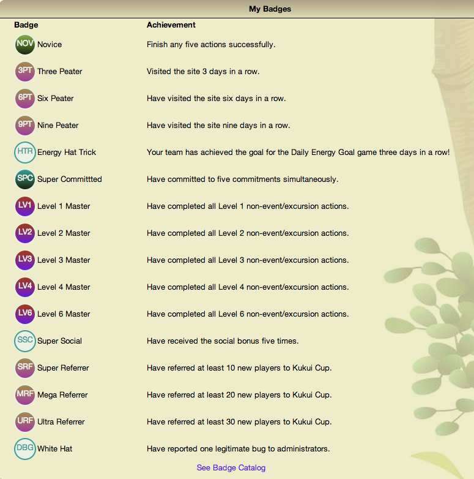
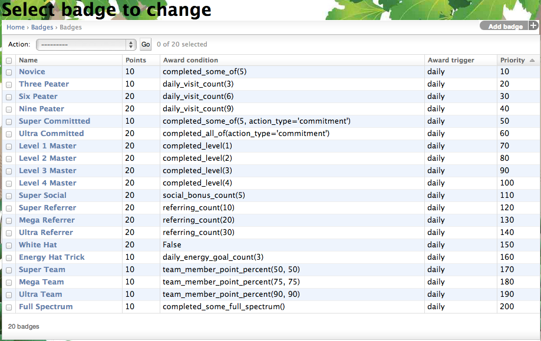

.. _section-configuration-game-admin-badge:

Design the Badge Game Mechanics
===============================

About Badge Game Mechanics
--------------------------

Badges are a common game mechanic, in which players receive recognition for various
accomplishments.  Makahiki allows the challenge designer to specify the set of badges
available in a challenge, and to define new ones. The challenge designer has the option of
making badges worth points.  Finally, the designer can use the Makahiki predicate system
to award a badge automatically (for example, when a player has completed a Level in the
Smart Grid Game), or manually award the badge through administrator action (for example,
when a player reports a significant bug in the system).

In many systems, each badge has a custom design, but in Makahiki, we decided
that the overhead of providing a custom graphic for each badge outweighed the benefits.
Providing a custom graphic also would creates complexity with another feature of Makahiki:
the ability to create "themes" with different colors (see
:ref:`section-theme-development`). To facilitate theme development, badges have a common
look and feel consisting of a circle and a multi-character ID. Its actual colors are specified by
the theme, and can thus vary from theme to theme.

Here is a screen image showing some badges accumulated by a player in a recent challenge:

Managing badges
---------------

After clicking on the "Badges" link in the Game Admin widget, a page similar to the following should appear:

This page displays all the badges in the system.

To add a new badge, click the "Add badge" button in the upper right corner.

Change a Badge
--------------

Clicking on a badge instance brings up a page with information about the badge:

.. figure:: figs/configuration/configuration-game-admin-badge-change.png
   :width: 600 px
   :align: center

Note the following:

  * *Name:* Should be unique within this set of badges.
  * *Slug:* You can allow the system to generate this; it must also be unique.
  * *Label:* What appears in the the badge icon; should be unique across all badge labels.
  * *Description:*  What achievment led to the badge award.
  * *Hint:*  What appears in the Badge Library page.  You can either specify exactly what
    earns the badge, or just provide a hint.
  * *Points:* How many points this badge is worth.  Could be zero.
  * *Priority:* Specifies the order in which the badges appear in the Badge Library page.
  * *Award condition:* Use "False" to award the badge manually, or else create a predicate
    to specify when the badge should be awarded to the player.
  * *Award trigger:* How often the system should check to see if badges should be awarded.
  * *Theme:* Select one of five possible themes.  The examples are based upon the current
    theme, but the actual display will be based upon whatever the player has selected.

.. note:: Remember to click the Save button at the bottom of the page when finished to save your changes.

