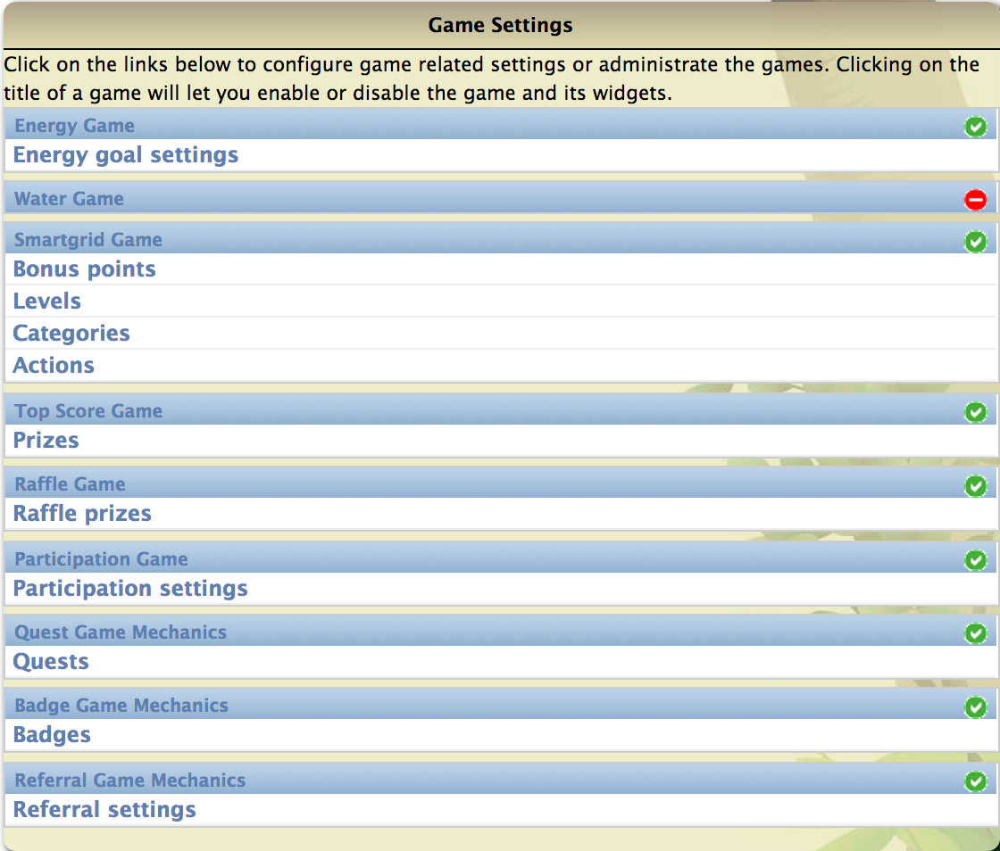

.. _section-configuration-game-admin-enable-disable:

Specify the games to appear in your challenge
=============================================

About the games
---------------

As a challenge designer, your responsibilities are limited to deciding which of the
pre-built games and game mechanics will appear in your challenge.   It is the role of
developers to actually create entirely new games for use in challenges. 

Makahiki currently allows you to create a challenge out of the following games and game
mechanics:

**Energy Game.**  This game awards points to players depending upon their ability to lower
their energy consumption.

**Water Game.**  This game awards points to players depending upon their ability to lower
their water consumption.

**Smart Grid Game.**  This game is the principle interface to the educational component of
Makahiki. The SGG awards points to players for successfully completing activities,
commitments, excursions, and events. 

**Top Score Game.**  This game awards prizes to players and teams for earning the highest
number of points during a round.

**Raffle Game.**  This game awards prizes to players if they have allocated their raffle
tickets to a particular raffle prize, and that raffle ticket was randomly selected by
the system at the end of a round.

**Participation Game.**  This game awards points to players if they can successfully get a
certain percentage of their team members to participate in the challenge.

**Quest Game Mechanics.**  This game mechanic provides a way for players to learn about features of
the challenge by guiding them through Quests.  

**Badge Game Mechanics.**  This game mechanic provides a way for players to earn badges
for playing the game in a variety of ways. 

**Referral Game Mechanics.**  This game mechanic provides a way for players to earn points
by getting other people to participate in the challenge. 

.. note:: Configuration of the set of games is **required**.  Either you will want to
   disable certain games or game mechanics in order to simplify your challenge, or you
   will need to configure certain games that are currently enabled (such as the Smart Grid Game).

Getting to the challenge design page
------------------------------------

The challenge design page shows the set of games available in Makahiki and whether or not
they are currently enabled for use in your challenge via the following widget:

The above image shows that this instance of Makahiki supports nine games.  The small green
and red icons on the right side indicate whether a game is currently enabled for the
challenge.  In this case, all of the games but one (Water Game) are enabled.

Changing the settings associated with a game
--------------------------------------------

Clicking on the title of a game will let you enable or disable the game and its widgets. After clicking on the title link in the Game Admin widget, a page similar to the following should appear:

.. figure:: figs/configuration/configuration-game-admin-game-settings.png
   :width: 600 px
   :align: center

By default, the game is enabled. You can uncheck the enabled checkbox to disable the game.

A game's UI is represented by a set of widgets which is visible in the game website. The
widgets belong to a game is listed under the "Game Settings" section, as shown from the
above screen shot. If you disable the game, all the widgets belong to this game will not
be shown in the web page.

Subsequent sections of this guide explain the configuration of each game.

.. note:: Remember to click the Save button at the bottom of the page when finished to save your changes.

