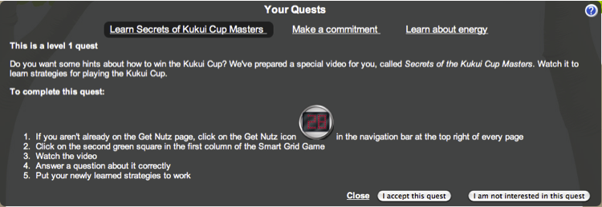
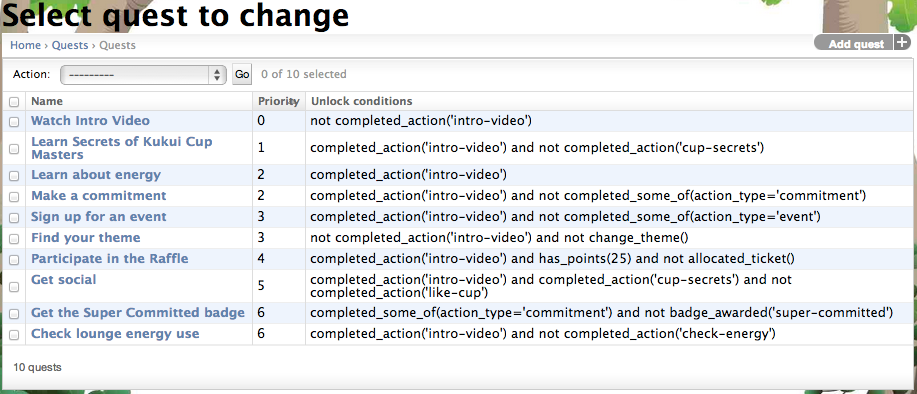

.. _section-configuration-game-admin-quest:

Design the Quest Game Mechanics
===============================

About the Quest Game Mechanic
-----------------------------

One fundamental challenge faced by any game is: how do players learn how to play it? This
is generally known as the *onboarding* problem.  One way that Makahiki addresses the
onboarding problem is through a "first login wizard" in which players (upon their first
login) step through a series of dialog boxes including a short video to introduce them to
the game.

However, the first login wizard gives only a very basic introduction to the system, and
there are many aspects of the game that it does not cover.  Players could "stumble" onto
these features over time, but with Quests, Makahiki provides a more proactive approach to
helping players learn about advanced features of the game.

Quests are made available to the player in a collapsible/expandable window right below the
navigation bar.  The set of Quests shown to a player can depend upon their game state, so
that "simple" Quests can be presented initially and more "complicated" Quests presented as
the player gains in expertise.  Quests generally guide the player through the various
workflows of the Challenge, such as completing a task, signing up for an event, or
allocating a raffle ticket.  

The system shows a maximum of three Quests at a time.  What follows is a screen shot of a Quest
window that can display three quests:  Learn Secrets of the Kukui Cup Masters, Make a
commitment, and Learn about Energy.   The first Quest has been clicked on, expanding the
window to reveal the description associated with that Quest. 

   *A quest that teaches a player how to use the Smart Grid Game to earn points.*

Quests are created by the administrator prior to the Challenge. Administrators have the
option of specifying a set of predicates to determine:

  * When the player could be shown a Quest;
  * When the player has performed actions indicating that they have completed the Quest,
    and it should no longer be shown. 

Players can also indicate explicitly that they have completed a Quest. 

Completion of a Quest does not currently earn a player any points.   The big advantage to this
is that Quests do not need to be verifiable, and thus a much broader variety of onboarding
experiences can be constructed as Quests.   The disadvantage is that some players might
not understand why they should do Quests, given that they don't earn any points for doing
them.  (Although completing Quests generally does lead to improved game play, which leads
to additional points, so there is an indirect incentive for performing Quests.)

Managing Quests
---------------

After clicking on the "Quests" link in the Game Admin widget, a page similar to the following should appear:

This page displays all the quests in the system.  When you design a Quest, you provide a
priority number, which imposes an ordering on the presentation of Quests.  

The algorithm for Quest display is as follows. The three quests with the lowest priority number whose:

  * unlock conditions evaluate to True
  * whose completion conditions evaluate to False
  * have not been explicitly indicated as "uninteresting" by the player are shown to the player.

To add a new quest, click the "Add quest" button in the upper right corner.

Change a Quest
--------------

Clicking on a quest instance brings up a page with information about the quest:

.. figure:: figs/configuration/configuration-game-admin-quest-change.png
   :width: 600 px
   :align: center

.. note:: Remember to click the Save button at the bottom of the page when finished to save your changes.

