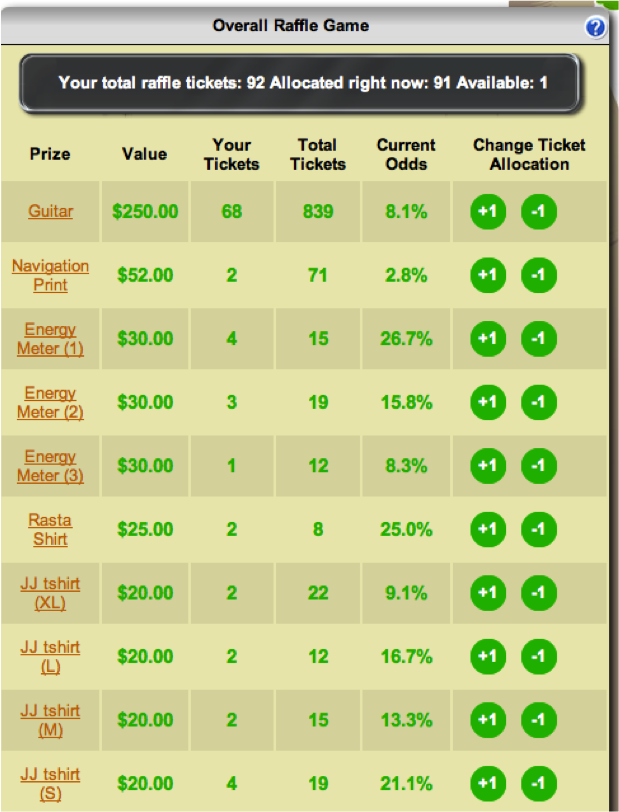

.. _section-configuration-game-admin-raffle-game:

Design the Raffle Game
======================

About the Raffle Game
---------------------

The Raffle Game was designed to solve the problem of incentivizing players who cannot hope
to be a top competitor in the Challenge.  When several hundred players are competing, only
a handful have a realistic chance to be the top scorers for a round.   Once a player knows
they cannot beat all of the other players, there can be an urge to simply give up. 

The Raffle Game is designed to enable all players to have a chance to win a wide variety
of prizes, where their odds of winning increase based upon the number points they have
earned in the game.  The following image shows a screenshot of a raffle game. 

The Raffle Game works in the following way.  For every 25 points (by default) that a player earns, they
receive one virtual raffle ticket. Players can dynamically allocate their tickets to any
raffle prizes they are interested in at any time, up to the end of the raffle. Each round
of the competition has its own set of raffle prizes and any unused raffle tickets carry
over to the next round. Raffle tickets are independent from a player's score; allocating a
raffle ticket does not affect their rank.

As the screen image above shows, each player can see in real-time how many Raffle Game Tickets
they have earned, which prizes they have allocated them to, and the resulting percentage
chance they have of winning based upon the tickets allocated by others to that same prize.
Of course, these odds can change on a moment-to-moment basis as players allocated and
deallocated tickets.

The Raffle Game, in addition to providing an incentive for the non-top players to earn
points, also creates an incentive for players to come back to the site on a regular basis
to see the updated odds associated with their choices. 

Setting up the Raffle Prizes
----------------------------

After clicking on the "Raffle Prizes" link in the Game Admin widget, a page similar to the following should appear:

.. figure:: figs/configuration/configuration-game-admin-raffle-game-list.png
   :width: 600 px
   :align: center

This page displays the raffle prize information for each round.

To add a new raffle prize, click the "Add raffle prize" button in the upper right corner.

Change a Raffle Prize
---------------------

Clicking on a raffle prize instance brings up a page with information about the raffle prize:

.. figure:: figs/configuration/configuration-game-admin-raffle-game-change.png
   :width: 600 px
   :align: center

The "Winner" of the raffle prize is normally randomly picked by the system at the end of the round. At the end of the page, you can also see a list of users that allocated raffle tickets for this raffle prize.

.. note:: Remember to click the Save button at the bottom of the page when finished to save your changes.

