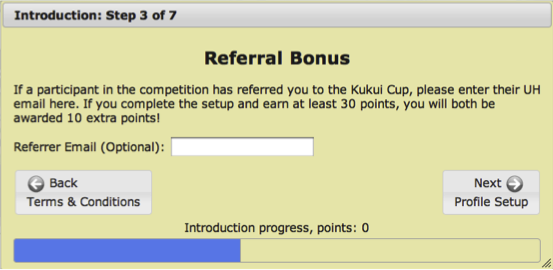

.. _section-configuration-game-admin-referral:

Design the Referral Game Mechanics
==================================

About the Referral Bonus 
------------------------

To incentivize players to work together during a challenge, Makahiki provides two types of
bonuses: social and referral. The social bonus is discussed in
:ref:`section-configuration-game-admin-smartgrid-game`. This section presents the referral
bonus, in which current players can earn points by getting new people on their team to
login to the system and complete the first login process.

When enabled, the referral bonus is implemented as a step in the first login process.  The following
figure shows this step:

If the new player was referred to the challenge by another player, they can use this step
to input their email address. Once the new player earns 30 points in the competition, both
players are awarded a referral bonus of (typically) 10 points. Typically, going through
the setup process gives you 25 points, so a threshold of 30 points means the new player
has to complete at least one additional task in order to get the referral bonus.

You can disable the referral game mechanics by clicking on the "Referral Game Mechanics"
link. If referral game mechanics is disabled, then this window is omitted from the first
login wizard and players will not be able to get points by referring other players.

The referral bonus also has a "dynamic bonus" capability.   If enabled, then you can vary
the amount of points awarded depending upon the participation level of the team associated
with the new player.  This incentivizes players to not just recruit new players for their
own team, but to also recruit players for other teams who might not have much
participation. 

Configure Referral Settings
---------------------------

If the referral game mechanics is enabled, which is true by default, you will see the "Referral settings" link in the Game Admin widget. After clicking on the "Referral Settings" link , You will see the overview of the referral settings, clicking on any of the links, will bring you to a page to change the settings:

.. figure:: figs/configuration/configuration-game-admin-referral.png
   :width: 600 px
   :align: center

By default, only the "Normal" referral points value is used.  If you check the "Start
dynamic bonus" setting, then the "Super" and "Mega" values are enabled depending upon the
team participation rate of the new player. 

.. note:: Remember to click the Save button at the bottom of the page when finished to save your changes.

