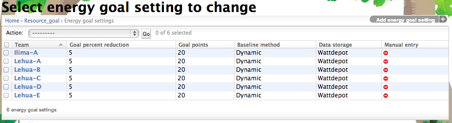

.. _section-configuration-game-admin-resource-game:

Design the Resource Goal Games
==============================

About resource goal games
-------------------------

To understand the design of resource goal games, it is useful to start by explaining the
design of the Energy Goal Game, then show how it can be extended to 
resources in general.

Design of the energy goal game
******************************

The purpose of the Energy Goal Game is to incentivize teams to work together to conserve
energy by showing their progress toward a daily goal, which is computed as a percentage
reduction from a baseline.  So, for example, if a team normally consumes 100 kWh of energy
in a day, the Energy Goal Game might award 20 points to every player in the team at the
end of the day if that team reduced their consumption by at least 5% (i.e. to 95 kWh or less). 

To provide a more visual sense, the following screen image shows one of the user interfaces to the Energy Goal
Game:

.. figure:: figs/configuration/game-design/degg-stoplight.png
   :width: 600 px
   :align: center

As you can see, this interface uses a stoplight metaphor to show at a glance whether or
not the team is making the goal.  In this case, the stoplight is green, indicating they
are currently below the goal.

During the design of the energy goal game, we faced two primary design challenges:

*What constitutes "normal" energy consumption?* To calculate a goal (i.e. target) energy
consumption, it is useful to have some estimate for what normal consumption would be
during the challenge period.  The traditional way to accomplish this is by monitoring energy
consumption data for each team for a period prior to the start of the challenge, and then
using this data to estimate what "normal" consumption would have been like during the
competition.  This process is normally referred to as generating a "baseline".

We realized that residence hall energy consumption is significantly different on weekends
(when many students might leave the building for travel) and weekdays.  Thus, it appears
important to calculate a separate baseline for each day of the week.

In Makahiki 1, we recommended that challenge designers gather energy data for at least
three weeks prior to the start of the challenge, and then calculate the baseline daily
energy consumption for each day by averaging the three values obtained for each day of the
week.
 
*What is the user interface?*  Let's assume that the baseline data collection resulted in
an average energy consumption of 100 kWh on Monday for a given team.  Let's also assume
that the goal is a 5% reduction, so we want to reward the team for using 95 kWh or less.
How to we provide feedback to the team on their progress toward the goal? 

One (naive) approach would be to simply divide the average daily consumption by 24 to get
the average hourly consumption for the given day, and then compare the actual consumption
to this projected consumption.  However, the problem with this approach is that residence
hall energy consumption is not consistent during the day: in fact, most of the consumption
occurs in the evening hours between 8pm and midnight.  Thus, this naive approach would
lull players into thinking that they were beating the goal for most of the day until late
evening, when their consumption would suddenly "catch up" to the goal.

To provide a more accurate sense for progress toward the goal, we recommend that challenge
designers not only gather energy data for each day of the week separately, but for each
hour of each day of the week separately.  That way the stoplight visualization can track
the team's consumption throughout the day, taking into account the typical "demand curve"
associated with the team. 

Other user interfaces to the energy goal game
*********************************************

While the stoplight visualization provides good feedback to a team regarding their current
progress toward making the current day's goal, other perspectives could be useful.

The following figure shows the Energy Goal Game scoreboard, which shows how teams are
faring relative to each other, and can incentivize teams to conserve not only to earn
points, but also to do better than other teams:

.. figure:: figs/configuration/game-design/degg-scoreboard.png
   :width: 400 px
   :align: center

Interestingly, the scoreboard shows that the number of times that a team makes their daily
energy goal is not perfectly correlated with their average reduction in energy consumption.

Another useful perspective to a team is a historical visualization that shows when they've
made the goal in the past, as shown in the following figure:

.. figure:: figs/configuration/game-design/degg-calendar.png
   :width: 400 px
   :align: center

Configure resource goal settings
--------------------------------

To configure a resource game, such as Energy and Water game, you will configure the resource goal settings first by clicking on the "Energy goal settings" or "Water goal settings" link in the Energy game or Water game admin widget. A page similar to the following should appear:

This is the list of energy goal settings for all the teams. Clicking on the team name link, will bring up the following screen to edit or change the goal settings, as shown in the following screenshot:

.. figure:: figs/configuration/configuration-game-admin-resource-game-goalsetting.2.png
   :width: 600 px
   :align: center

You can also click on the "Add new goal settings" button in the list page to create the goal settings for a new team.

.. note:: Remember to click the Save button at the bottom of the page when finished to save your changes.

