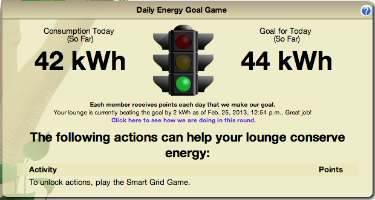
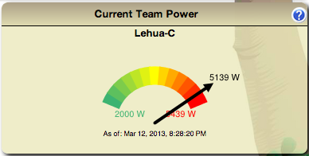
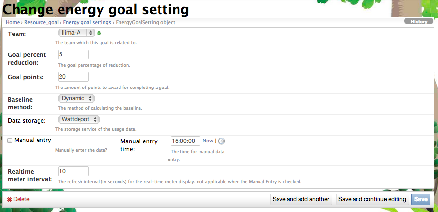

.. _section-configuration-game-admin-resource-game:

Design the Resource Goal Games
==============================

About resource goal games
-------------------------

To understand the design of resource goal games, we believe it will be useful to start by explaining the
design of the Energy Goal Game, then show how it has been extended to 
resources in general.

Design of the energy goal game
******************************

The purpose of the Energy Goal Game is to incentivize teams to work together to conserve
energy by showing their progress toward a daily goal, which is computed as a percentage
reduction from a baseline.  So, for example, if a team normally consumes 100 kWh of energy
in a day, the Energy Goal Game might award 20 points to every player in the team at the
end of the day if that team reduced their consumption by at least 5% (i.e. to 95 kWh or less). 

To provide a more visual sense, the following screen image shows the "stoplight" user
interface to the Energy Goal Game:

   *The stoplight visualization for the Energy Goal Game*

As you can see, this interface uses a stoplight metaphor to show at a glance whether or
not the team is making the goal.  In this case, the stoplight is green, indicating they
are currently below the goal.

During the design of the energy goal game, we faced two primary design challenges:

*What constitutes "normal" energy consumption?* To calculate a goal (i.e. target) energy
consumption, it is useful to have some estimate for what normal consumption would be
during the challenge period.  The traditional way to accomplish this is by monitoring energy
consumption data for each team for a period prior to the start of the challenge, and then
using this data to estimate what "normal" consumption would have been like during the
competition.  This process is normally referred to as generating a "baseline".

We realized that residence hall energy consumption is significantly different on weekends
(when many students might leave the building for travel) and weekdays.  Thus, it appears
important to calculate a separate baseline for each day of the week.

In Makahiki 1, we recommended that challenge designers gather energy data for at least
three weeks prior to the start of the challenge, and then calculate the baseline daily
energy consumption for each day by averaging the three values obtained for each day of the
week.
 
*What is the user interface?*  Let's assume that the baseline data collection resulted in
an average energy consumption of 100 kWh on Monday for a given team.  Let's also assume
that the goal is a 5% reduction, so we want to reward the team for using 95 kWh or less.
How to we provide feedback to the team on their progress toward the goal? 

One (naive) approach would be to simply divide the average daily consumption by 24 to get
the average hourly consumption for the given day, and then compare the actual consumption
to this projected consumption.  However, the problem with this approach is that residence
hall energy consumption is not consistent during the day: in fact, most of the consumption
occurs in the evening hours between 8pm and midnight.  Thus, this naive approach would
lull players into thinking that they were beating the goal for most of the day until late
evening, when their consumption would suddenly "catch up" to the goal.

To provide a more accurate sense for progress toward the goal, we recommend that challenge
designers not only gather energy data for each day of the week separately, but for each
hour of each day of the week separately.  That way the stoplight visualization can track
the team's consumption throughout the day, taking into account the typical "demand curve"
associated with the team. 

Additional goal game interfaces: the scoreboard view
****************************************************

While the stoplight visualization provides good feedback to a team regarding their current
progress toward making the current day's goal, we have found additional perspectives to
also be useful. 

The following figure shows the Energy Goal Game scoreboard, which shows how teams are
faring relative to each other, and can incentivize teams to conserve not only to earn
points, but also to do better than other teams:

.. figure:: figs/configuration/game-design/degg-scoreboard.png
   :width: 400 px
   :align: center

   *The scoreboard visualization for the Energy Goal Game*

Interestingly, the scoreboard shows that the number of times that a team makes their daily
energy goal is not perfectly correlated with their average reduction in energy
consumption.

Additional goal game interfaces: the Realtime Power meter view
**************************************************************

One useful perspective to a team is a realtime power meter visualization that
shows the current power usage of a team, as shown
by the following figure:

   *The power meter visualization*

This visualization displays the realtime power consumption which updates in a specified interval. This give players the sense of energy consumption at the monent. For example, some one turns on a high power microwave, they might see a spike in the realtime power meter reflecting the power usage at that monent.

Additional goal game interfaces: the calendar view
**************************************************

Another useful perspective to a team is a historical, calendar-based visualization that
shows the results of the energy goal game for each day of the current round, as shown 
by the following figure:

.. figure:: figs/configuration/game-design/degg-calendar.png
   :width: 400 px
   :align: center

   *The calendar visualization for the Energy Goal Game*

This visualization is useful for helping teams to see if there are patterns to their
ability to make their goal.  The above display shows that they have been making their goal
more regularly in the recent past, indicating perhaps that they have identified a useful
strategy for conservation.

Automated vs. manual data collection
************************************

Makahiki supports both automated and manual data collection.  With
respect to automated energy collection, Makahiki queries a WattDepot server once an hour to get an update on
each team's consumption during the previous hour, and then updates the stoplight
visualization.  At midnight, Makahiki determines whether the conservation goal was
achieved by the team and updates the calendar-based view with the results for that day.

However, not all challenge player communities have meters that are
internet-accessible and thus allow this kind of real-time, automated update.  Instead,
they might have a traditional, analog meter.

The Energy Goal Game can be configured to support manual data collection. To accomplish
this, the challenge designers must first tell the system the time each day at which they will
read the meters manually. (To make the energy goal game workable, the challenge designers
must commit to reading the energy meters for each team at approximately the same time each day so
Makahiki can assume the data represents equal, 24 hour intervals. Team meters can be read
at different times, but the time must be consistent for each team.)

Then, each day during the challenge, the challenge designers read the meters, then login to
the system and update Makahiki with the latest readings.  From this, Makahiki can
determine which teams made their energy goal for the previous day. 

From a user interface perspective, the basic difference is that the stoplight
visualization is not available. Instead, the primary interface to the Energy Goal Game is
the calendar-based visualization, which shows the results for each day.

From Energy Goal Games to Resource Goal Games
*********************************************

Now that you understand the various interfaces to the Energy Goal Game, and the issues of
manual vs. automated data collection, it is simple to understand the concept of "Resource"
goal games.  

Basically, we realized that once we had support for both automated and manual energy data
collection, we were well on our way to supporting Water Goal Games, Food Goal Games, Waste
Goal Games, or any other "resource" for which teams are responsible.  So, we reorganized
the Makahiki code base for the Energy Goal Game to support a family of games, one per
resource.  

Currently, Makahiki provides built-in support for two resource goal games: energy and water.
Each of those games, when enabled, results in a page devoted to that resource in the web
application. The default configuration disables support for the Water Goal Game and the
Water page. 

Extending Makahiki to support an additional resource goal game is straightforward, but 
requires developer-level capabilities.  

The problem with baselines
**************************
 
The preceding discussion makes perfect sense, but there is an important assumption
underlying the design of the game.  This assumption is that it is possible to collect
historical data that can be analyzed and used to compute an accurate prediction of
"normal" resource consumption during the challenge period.   This is essential, because if
you cannot accurately predict "normal" consumption (i.e. what the consumption would have
been in the absence of the challenge), you cannot calculate "conservation" in a meaningful
way, and thus the achieving of the goal might not reflect actual team behavior. 

Our experience with Makahiki has convinced us that this is a significant issue in the
design of serious games for sustainability.   The issue is too complex to go into here,
but for more information, we recommend that challenge designers read our article 
"`Beyond kWh\: Myths and fixes for energy competition game design`_". 

.. _Beyond kWh\: Myths and fixes for energy competition game design: http://www.citeulike.org/group/3370/article/11239956

A concrete outcome of this research is that Makahiki now offers two ways to calculate
baselines: "fixed" and "dynamic".  The "fixed" baseline approach uses historical data to
calculate baselines in the traditional fashion explained above. 

Our more experimental approach is called "dynamic" baselines.  In this approach, baselines
are calculated using the last two weeks of data, even when that data occurs during the
actual challenge.   As a result, dynamic baselines do not attempt to characterize or
predict "normal" behavior, but instead constantly recalibrate themselves to the team's
most recent behavior by asking them to effectively "do a little better than they did
before".  At some point, teams will not be able to conserve any more, and they will stop
being able to achieve their goal.  If their consumption increases from their, the baseline
will reset itself and the goal will once again be achievable.   Evaluation of this
strategy is still ongoing: while it overcomes certain problems with fixed baselines, it
has its own trade-offs (such as the fact that a team will always reach a point at which
they can no longer make their goal.) 

Configure resource goal game settings
-------------------------------------

There is no link to "resource goal game" in the system.  Instead, there are links to the
currently implemented games in this "family" of games. At present, there are links to configure the 
Energy Goal Game and the Water Goal Game in the top-level challenge design page.  
From there, clicking on Energy Goal settings
in the Energy Game admin widget will produce a page similar to the following:

.. figure:: figs/configuration/configuration-game-admin-resource-game-goalsetting-1.png
   :width: 600 px
   :align: center

This is the list of energy goal settings for all teams. Clicking on the team name link
brings up a form to edit or change the goal settings. You can also add an energy goal game
for a new team using the "Add energy goal setting" in the upper right corner.

Once you've clicked a team, you get the following configuration page:

Given the discussion above, the settings should now be understandable:

  * *Team*: Select the team name to be associated with these settings.  Normally, you'll
    want all teams to have the same settings, but Makahiki allows you to configure each
    team individually.
 
  * *Goal percent reduction*:  Specifies the required percentage reduction from the baseline value for the
    current day in order to earn the points.

  * *Goal points.*  All active players of the team receive this number of points if the
    conservation goal is met.   To be active, a player must have logged in to the system
    and completed the first login wizard. 

  * *Baseline method.*  Choose "Fixed" for the traditional method, "Dynamic" for the
    experimental dynamic baseline method. 

  * *Data storage.*  Only WattDepot is currently supported. 

  * *Manual entry*. Click this checkbox to enable manual entry.  Specify the time of day
    when the data will be entered.

  * *Realtime meter interval*.  How frequently the data storage mechanism will be
    queried to update the real-time meter.

You can also click on the "Add new goal settings" button in the list page to create the goal settings for a new team.

.. Note:: Every team should have the goal settings. In fact, when you create a team, the default resource (energy and water) goal settings is created for this team. The designer should check the default value to see if they are what they want and if they are consistent across other teams.

.. Note:: Remember to click the Save button at the bottom of the page when finished to save your changes.

