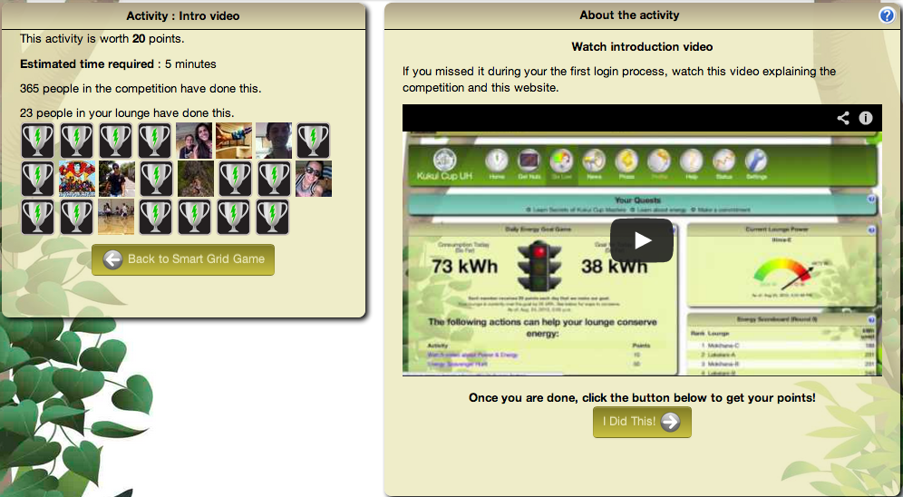
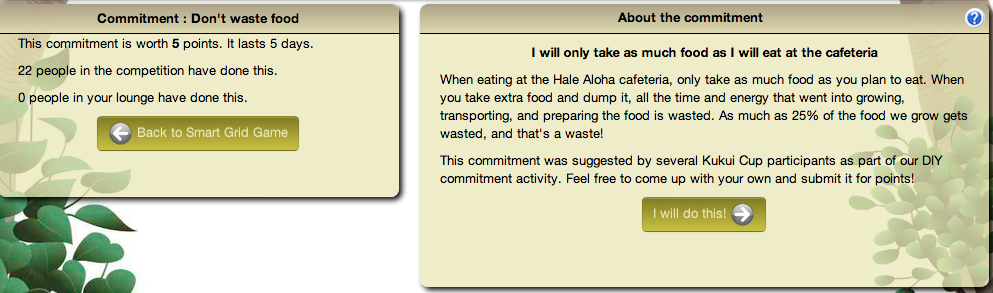
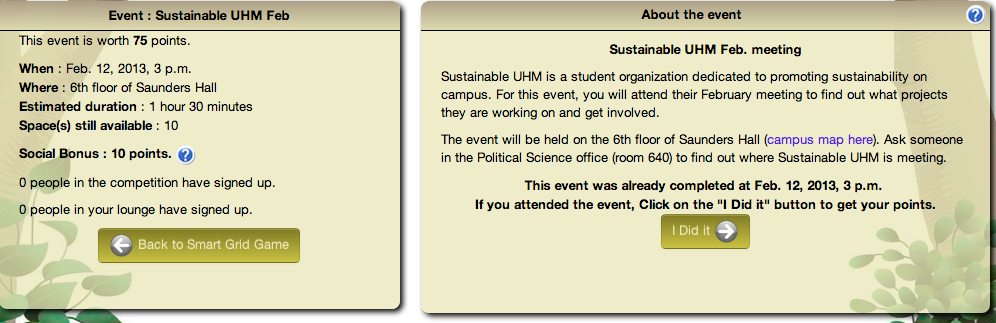
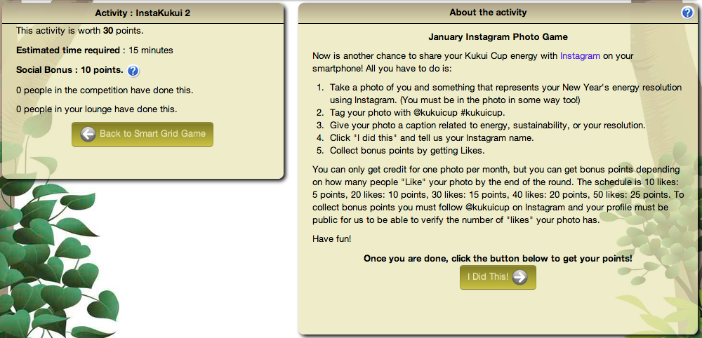

.. _section-configuration-game-admin-smartgrid-game:

Design the Smart Grid Game
==========================

About the Smart Grid Game
-------------------------

Makahiki provides the Smart Grid Game (SGG) to support "gamified" delivery of educational
experiences.  Players use its grid interface to discover "actions" they can
perform. Successful completion of an action earns the player a variable number of points
depending upon the difficulty of the action, and can potentially "unlock" additional actions in the
SGG.  There are five types of actions: activities, commitments, events, excursions, and
creative.  As a challenge designer, your task is to design an SGG that contains
educational experiences suitable for your players, and also design the "path" that players
take through the SGG through the unlocking of new actions.

The following screen image shows a typical Smart Grid Game interface for players:

.. figure:: figs/configuration/configuration-game-admin-smartgrid-game-interface.png
   :width: 400 px
   :align: center

This image reveals several important aspects of the SGG:

**Levels.** Each Smart Grid Game can have from 1 to 7 "Levels". (More than 7 Levels
becomes awkward when viewing the game on a mobile device.) The screen image above
has 7 levels. In typical SGG designs, players begin with access only to the first Level.
Higher Levels become unlocked for a player either because they completed a lower level or 
because a Level is designed to unlock automatically when a given date is reached during
the challenge.

**Categories.** Each Level of a Smart Grid Game has a set of columns, labelled with a name
called its "category".  In this screen image, the first category is "Get Started",
and there are five categories total.  For best viewing on a mobile device, we recommend no
more than 5 categories (as in this screen image).  Levels can have differing numbers of
categories. 

**Actions.** The cells underneath a category label provide access to "Actions".  There are
several action types: Activity, Commitment, Event, Excursion, Video.  The color of the
cells indicates their action type.  In the screen image, each of the five categories has
five Action cells, so this Level of this Smart Grid Game has a total of 25 Actions.  In
order to create a rectangular grid, designers can also create "filler" actions, which
occupy a space in the grid but cannot be otherwise manipulated by players.  There are no
"filler" actions in the above example, but the legend shows that they would be colored
gray if one or more were present.

**State of play.** Cells are "decorated" with information that indicates the state of
play.   

  * If an action is unlocked and thus available for the player, then the cell provides
    a number indicating the point value of that action if completed. In the image above,
    unlocked cells indicate actions ranging in value from 5 to 100 points.  

  * If an action is not yet unlocked, then instead of a number, it shows a lock icon.  

  * If the cell corresponds to an an event or excursion that has already occurred, it is
    labeled as "Expired".  

  * If the action has been submitted or completed by the player, then instead of a point value, the
    name of the action appears in the cell.  For example, the image above shows that this
    player has completed the "Intro Video" action. 

  * Finally, actions are typically in one of three states: submitted, completed, or
    rejected (in which case the player can resubmit a revised answer to get full credit.)
    Small icons (orange, green, or red) indicate this state. 

About actions
------------- 

Activity
********

**Activities** are the most basic action available in the Smart Grid. In order to get points
for an activity, a player must input a response to the system, which is reviewed and
approved or disapproved by administrators. These responses
can be a short textual answer or an uploaded picture. If a submission is
approved, the player receives the points for their submission. Otherwise, the system
notifies the player that their submission was not approved,
along with a comment (writte by an administrator) explaining why it was rejected. The player can
change and resubmit their response and still earn the full point value for that task. The
following figure illustrates a sample activity:

   *Sample activity in the Smart Grid Game*

Commitment
**********

**Commitments** are pledges that the player will carry out a specific action for a
specific amount of time (typically 5 days). Examples include: reducing shower time, taking
the stairs, and turning off the lights when leaving a room. Unlike activities, commitments
are not easily verifiable, and so they are usually designed with fewer points than
activities. Furthermore, a player can only enter into five commitments at any given
time. After the commitment period is up, the player can declare that they completed the
commitment and immediately earn the associated points. They can then enter into another
commitment, including the one they just completed.  The following figure illustrates a
sample commitment:

   *Sample commitment in the Smart Grid Game*

Events and Excursions
*********************

**Events and excursions** are actions tied to real world meetings. Events are typically
held in or near the challenge location while excursions typically require
transportation. To help organizers gauge interest in events and excursions, players can
earn points by signing up in advance. Players that do this (and then actually attend the
event or excursion) earn a signup bonus (typically 2 points). Players can also set up a
reminder that is sent to their email and/or their mobile phone before the meeting takes
place. At the event or excursion, a challenge administrator provides players with
"attendance codes" printed on slips of paper that can be later entered in the system by
the player to get their points.  (The paper slips provide a form of verification that the
player physically attended the event or excursion.)  Attendance codes are generated by
Makahiki and can only be used once. To discourage players from signing up and not
attending, a penalty (typically 2 points) is assessed to players who do not submit an
attendance code. If the player submits an attendance code for the event after receiving
this penalty, the penalty is reversed.  The following figure illustrates a sample event:

   *Sample event in the Smart Grid Game*

Creative
********

**Creative actions** enable players to exercise their artistic talents.  These are often worth a
variable number of points, depending upon the effort made by the player and the quality of
the outcome (as judged by administrators).  Examples of creative activities include: make
a poem, make a video, write a letter to the editor, write a song, and create a photo
blog. The following figure illustrates a creative activity:

   *Sample creative activity in the Smart Grid Game*

Designing a Smart Grid Game
---------------------------

Designing the Smart Grid Game is one of the most complicated parts of the Kukui Cup
planning process, because the Smart Grid Game is the "portal" through which players get
access to the various "actions" (activities, commitments, events, excursions, and
creatives) of the Kukui Cup: in short, virtually all of the "real world" experiences. 

Specify your content
********************

To design an SGG, the first step is to determine the content for your challenge, which
means answering the following questions:

  * What are the events (if any) in your challenge?
  * What are the excursions (if any) in your challenge?
  * What are the commitments (if any) in your challenge?
  * What are the videos (if any) in your challenge?
  * What are the non-video activities in your challenge? 

To help bootstrap your design process, we have created a library of almost 100 actions
that you can use for inspiration.  They are organized as a Google Spreadsheet with various
subsheets to show different perspectives on the information.  The following figure shows a
screen image of the spreadsheet. Click on the link in the caption to go to the live google
spreadsheet.

.. figure:: figs/sgg/sgg-library-spreadsheet.png
   :width: 600 px
   :align: center
   
   See the `action library`_ online.

.. _action library: https://docs.google.com/spreadsheet/ccc?key=0An9ynmXUoikYdE4yaWRPVTlZdTg2Y1V5SWNTeUFjcWc#gid=2

Versions of these actions are also provided in the default configuration of Makahiki, so
you don't have to retype all of the information. 

To complete this design step, create a simple document that lists the titles of all of your proposed
content. 

Specify the "path" of actions
*****************************

To make your SGG more interesting to players, and more pedagogically sophisticated, you
will want to define "paths" through the content.   In most cases, when a new player sees
the SGG for the first time, there should only be a few actions available to
them---possibly only one.   All of the rest should be "locked".   

Begin by specifying the initial, "seed" actions in your SGG: those that are always unlocked.

Next, specify the actions that should be unlocked once one or more of the seed actions
are successfully completed by players.  The content of these new actions can now
potentially depend upon the information presented in the initial actions, since the game
itself guarantees that players will have completed "dependent" actions before being
able to see the new action.   

A second way to specify that an action should be unlocked is by time and date.  For
example, you may want to make events and excursions visible to participants starting five
days before their actual occurrence. In this case, players don't have to complete any 

Specify the layout
******************

The SGG Admin Widget
--------------------

The following screenshot is an overview of the smart grid game admin widget:

.. figure:: figs/configuration/configuration-game-admin-smartgrid-game-1.png
   :width: 600 px
   :align: center

Configure the set of levels
---------------------------

The first step is to specify the set of levels in your SGG. 
Click on the "Levels" link in the admin widget, a page similar to the following should appear:

.. figure:: figs/configuration/configuration-game-admin-smartgrid-game-level-list.png
   :width: 600 px
   :align: center

This is the list of levels for the smart grid game. Clicking on the name link will bring up the following screen to edit or change the level:

.. figure:: figs/configuration/configuration-game-admin-smartgrid-game-level-change.png
   :width: 600 px
   :align: center

The name of the level is the label shown in the smart grid game. The priority orders the levels, 
lowest to highest. The unlock condition is a :ref:`section-predicates` that will unlock the level. 
The unlock text is the help text presented to the player explaining what they need to accomplish to 
unlock the level.

You can also click on the "Add level" button in the list page to create a new level.

Configure the Category
----------------------

The next step is to specify the category titles in your SGG. Similar to the  configuration of 
levels, you click the "Categories" link to change an existing category or 
add a new category for the smart grid game.

.. figure:: figs/configuration/configuration-game-admin-smartgrid-game-category-list.png
   :width: 600 px
   :align: center

This is the list of possible categories for the smart grid game. Clicking on the name link, will 
bring up the following screen to edit or change the category, as shown in the following screenshot:

.. figure:: figs/configuration/configuration-game-admin-smartgrid-game-category-change.png
   :width: 600 px
   :align: center

The name is the label used in the smart grid game, the slug is referenced by smart grid actions to 
determine which category the action belongs to. The priority determines how the categories are layed 
out in the smart grid game, lowest to highest.

Configure the set of actions
----------------------------
The next step is to specify the actions for your smart grid game. It is the most complicated and time consuming part, depending on the size and complexity of your smart grid game.

By clicking on the "Actions" link, you will see a page similar to the following:

.. figure:: figs/configuration/configuration-game-admin-smartgrid-game-action-list.png
   :width: 600 px
   :align: center

You can see that the actions are uniquely identified by their slug. They are organized in the order of "Level, Category, and Priority", which corresponding to the layout of the smart grid. You can select (use the checkbox on the left of the action) some actions, then click on the "Action" dropdown, to perform several group operations to the selected actions, such as changing their levels, increase priority etc.

You can also click on the "Slug" link to change the content of the action, as shown in the following screenshot:

.. figure:: figs/configuration/configuration-game-admin-smartgrid-game-action-change.png
   :width: 600 px
   :align: center

Adding an Activity
------------------

You can click on the "Add Activity" button on the top right corner of the page to add a new activity that normally requires player submit the answer and response.

The following page is an example of an activity type action:

.. figure:: figs/configuration/configuration-game-admin-smartgrid-game-activity.png
   :width: 600 px
   :align: center

Adding an Event/Excursion
-------------------------

You can click on the "Add Event/Excursion" button on the top right corner of the page to add a new event or excursion.

The following page is an example of an activity type action:

.. figure:: figs/configuration/configuration-game-admin-smartgrid-game-event.png
   :width: 600 px
   :align: center

For excursion, the "is excursion" checkbox need to be set.

Adding a Commitment
-------------------

You can click on the "Add Commitment" button on the top right corner of the page to add a new commitment.

The following page is an example of an activity type action:

.. figure:: figs/configuration/configuration-game-admin-smartgrid-game-commitment.png
   :width: 600 px
   :align: center

.. note:: Remember to click the Save button at the bottom of the page when finished to save your changes.

