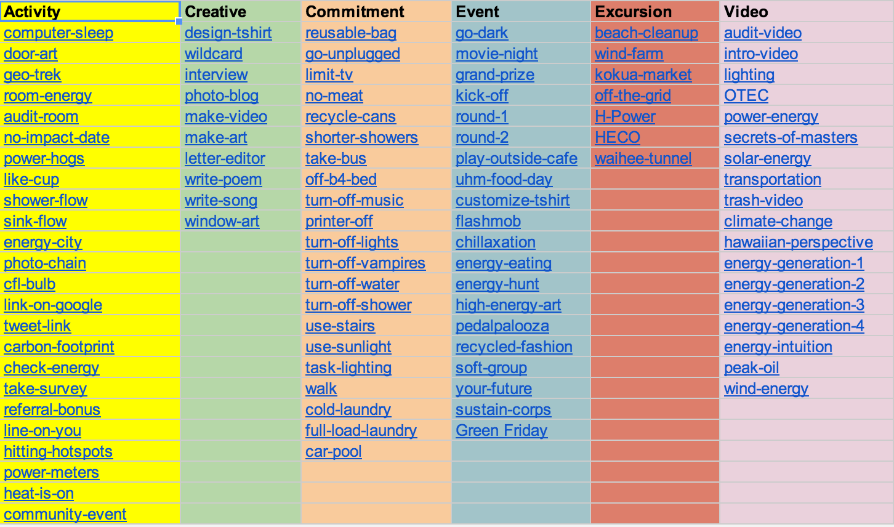

.. _section-configuration-game-admin-smartgrid-game:

Design the Smart Grid Game
==========================

About the Smart Grid Game
-------------------------

The Smart Grid Game (SGG) is a widget provided in Makahiki to support "gamified" delivery
of educational content.  Players use its grid interface to discover "actions" they can
perform. Successful completion of an action earns the player a variable number of points
depending upon the difficulty of the action.  There are five types of actions: activities,
commitments, events, excursions, and creative.  Challenge designers tailor their SGG to
deliver the educational content of interest, as well as tailoring the "paths" players can
take through the SGG as they complete actions.  

The following screen image shows a typical Smart Grid Game interface:

.. figure:: figs/configuration/configuration-game-admin-smartgrid-game-interface.png
   :width: 400 px
   :align: center

There are three basic user interface components in the Smart Grid Game:

  * **Levels.**  Each Smart Grid Game can have from 1 to 7 "Levels".  The screen image above
    has 7 levels. Players begin with
    access to the first level.  Additional levels can be unlocked based upon players
    completing lower levels and/or certain dates and times being reached during the
    challenge.

  * **Categories.**  Each Level of a Smart Grid Game has a set of columns, labelled with a
    name corresponding to its category.  In this screen image, the first category is "Get Started", and there are
    five categories total.  Each Level has different category names and can
    even have a different number of categories. 

  * **Actions.**  The cells underneath a category label correspond to "Actions".  There
    are several action types:  Activity, Commitment, Event, Excursion, Video.  In the
    screen image, each of the five categories has five Action cells, so this Level of
    this Smart Grid Game has a total of 25 Actions. 

About actions
------------- 

**Activities** are the most basic action available in the Smart Grid. In order to get points
for an activity, a player must input a response to the system, which is reviewed and
approved or disapproved by administrators. These responses
can be a short textual answer or an uploaded picture. If a submission is
approved, the player receives the points for their submission. Otherwise, the system
notifies the player that their submission was not approved,
along with a comment (writte by an administrator) explaining why it was rejected. The player can
change and resubmit their response and still earn the full point value for that task.

**Commitments** are pledges that the player will carry out a specific action for a
period of five days. Examples include: reducing shower time, taking the stairs, and
turning off the lights when leaving a room. Because these commitments are not verifiable,
they are typically worth fewer points than activities. Furthermore, a player can only have up to
five active commitments at any given time. After the five day period is up, the player can
then declare that they completed the commitment and immediately earn their points. They
can then sign up for another commitment, including the one they just completed.

**Events and excursions** are actions tied to real world meetings. Events are typically held in or near
the challenge location while excursions typically require transportation. To help
organizers gauge interest in events and excursions, players
can earn points by signing up in advance. Players that do this (and then actually attend
the event or excursion) are
earn a 2 point signup bonus. Players can also set up a reminder that is sent to
their email and/or their mobile phone before the meeting takes place. At the event or excursion, a
challenge administrator provides players with "attendance codes" printed on slips of paper
that can be later entered in the system by the player to get their points.  (The paper
slips provide a form of verification that the player physically attended the event or excursion.)
Attendance codes are generated by Makahiki
and can only be used once. To discourage players from signing up and not attending, a 2
point penalty is assessed to players who do not submit an attendance code. If the player
submits an attendance code for the event after receiving this penalty, the penalty is
reversed.

**Creative actions** enable players to exercise their artistic talents in an energy-related
way.  These are worth a variable number of points, depending upon the effort made by the
player and the quality of the outcome (as judged by administrators).  Examples of creative activities
include: make a poem, make a video, write a letter to the editor, write a song, and create
a photo blog.

Only a few of the many possible actions in the Smart Grid Game are available when a player
logs in for the first time. Challenge designers configure each action through a set of
predicates that determine if the action is locked or unlocked for a player at any
given point in time. These predicates include: completed a certain number of tasks within
a category, completed all tasks within a category, completed certain tasks, and time-based
unlocking (available after a certain date).  Administrators can use logical operators to
combine these predicates in order to organize the players' "path" through the Smart Grid
Game.

Designing a Smart Grid Game
---------------------------

Designing the Smart Grid Game is one of the most complicated parts of the Kukui Cup
planning process, because the Smart Grid Game is the "portal" through which players get
access to the various "actions" (activities, commitments, events, excursions, and
creatives) of the Kukui Cup: in short, virtually all of the "real world" experiences. Here
are the basic issues you must decide:

  * What are the events (i.e. meetings) that you plan to organize?
  * What are the excursions (i.e off-campus meetings that require transportation) if any? 
  * What are the activities (regular and "creative"), and how do they work together to
    provide a cohesive educational experience?
  * What custom content do you need to design for your players? (The Action Library below is probably not sufficient.) 
  * What is the "path" of actions that you wish players to follow as they move through
    your Smart Grid Game?  In other words, what is required for an action to become
    unlocked and accessible to players? In general, actions get unlocked either due to one
    more more other actions being completed by a player, or because a certain date in time
    has been reached.  By appropriate design of the "dependencies" among actions, you can
    ensure that when players first look at the smart grid game, they have only a few
    choices of actions to accomplish.  Then, as they achieve these, more and more actions
    become available.

The SGG Action Library
----------------------

To support the design process, we have created a library of almost 100 actions that you
can use for inspiration in designing your Smart Grid Game.  We've organized them
as a Google Spreadsheet with various subsheets to show different perspectives on the
information.  The following figure shows a screen image of the spreadsheet. Click on the
link in the caption to go to the live google spreadsheet.

   
   See the `action library`_ online.

.. _action library: https://docs.google.com/spreadsheet/ccc?key=0An9ynmXUoikYdE4yaWRPVTlZdTg2Y1V5SWNTeUFjcWc#gid=2

The SGG Admin Widget
--------------------

The following screenshot is an overview of the smart grid game admin widget:

.. figure:: figs/configuration/configuration-game-admin-smartgrid-game.1.png
   :width: 600 px
   :align: center

Configure the set of levels
---------------------------

The first step is to specify the set of levels in your SGG. 
Click on the "Levels" link in the admin widget, a page similar to the following should appear:

.. figure:: figs/configuration/configuration-game-admin-smartgrid-game-level-list.png
   :width: 600 px
   :align: center

This is the list of levels for the smart grid game. Clicking on the name link will bring up the following screen to edit or change the level:

.. figure:: figs/configuration/configuration-game-admin-smartgrid-game-level-change.png
   :width: 600 px
   :align: center

The name of the level is the label shown in the smart grid game. The priority orders the levels, 
lowest to highest. The unlock condition is a :ref:`section-predicates` that will unlock the level. 
The unlock text is the help text presented to the player explaining what they need to accomplish to 
unlock the level.

You can also click on the "Add level" button in the list page to create a new level.

Configure the Category
----------------------

The next step is to specify the category titles in your SGG. Similar to the  configuration of 
levels, you click the "Categories" link to change an existing category or 
add a new category for the smart grid game.

.. figure:: figs/configuration/configuration-game-admin-smartgrid-game-category-list.png
   :width: 600 px
   :align: center

This is the list of possible categories for the smart grid game. Clicking on the name link, will 
bring up the following screen to edit or change the category, as shown in the following screenshot:

.. figure:: figs/configuration/configuration-game-admin-smartgrid-game-category-change.png
   :width: 600 px
   :align: center

The name is the label used in the smart grid game, the slug is referenced by smart grid actions to 
determine which category the action belongs to. The priority determines how the categories are layed 
out in the smart grid game, lowest to highest.

Configure the set of actions
----------------------------
The next step is to specify the actions for your smart grid game. It is the most complicated and time consuming part, depending on the size and complexity of your smart grid game.

By clicking on the "Actions" link, you will see a page similar to the following:

.. figure:: figs/configuration/configuration-game-admin-smartgrid-game-action-list.png
   :width: 600 px
   :align: center

You can see that the actions are uniquely identified by their slug. They are organized in the order of "Level, Category, and Priority", which corresponding to the layout of the smart grid. You can select (use the checkbox on the left of the action) some actions, then click on the "Action" dropdown, to perform several group operations to the selected actions, such as changing their levels, increase priority etc.

You can also click on the "Slug" link to change the content of the action, as shown in the following screenshot:

.. figure:: figs/configuration/configuration-game-admin-smartgrid-game-action-change.png
   :width: 600 px
   :align: center

Adding an Activity
------------------

You can click on the "Add Activity" button on the top right corner of the page to add a new activity that normally requires player submit the answer and response.

The following page is an example of an activity type action:

.. figure:: figs/configuration/configuration-game-admin-smartgrid-game-activity.png
   :width: 600 px
   :align: center

Adding an Event/Excursion
-------------------------

You can click on the "Add Event/Excursion" button on the top right corner of the page to add a new event or excursion.

The following page is an example of an activity type action:

.. figure:: figs/configuration/configuration-game-admin-smartgrid-game-event.png
   :width: 600 px
   :align: center

For excursion, the "is excursion" checkbox need to be set.

Adding a Commitment
-------------------

You can click on the "Add Commitment" button on the top right corner of the page to add a new commitment.

The following page is an example of an activity type action:

.. figure:: figs/configuration/configuration-game-admin-smartgrid-game-commitment.png
   :width: 600 px
   :align: center

.. note:: Remember to click the Save button at the bottom of the page when finished to save your changes.

