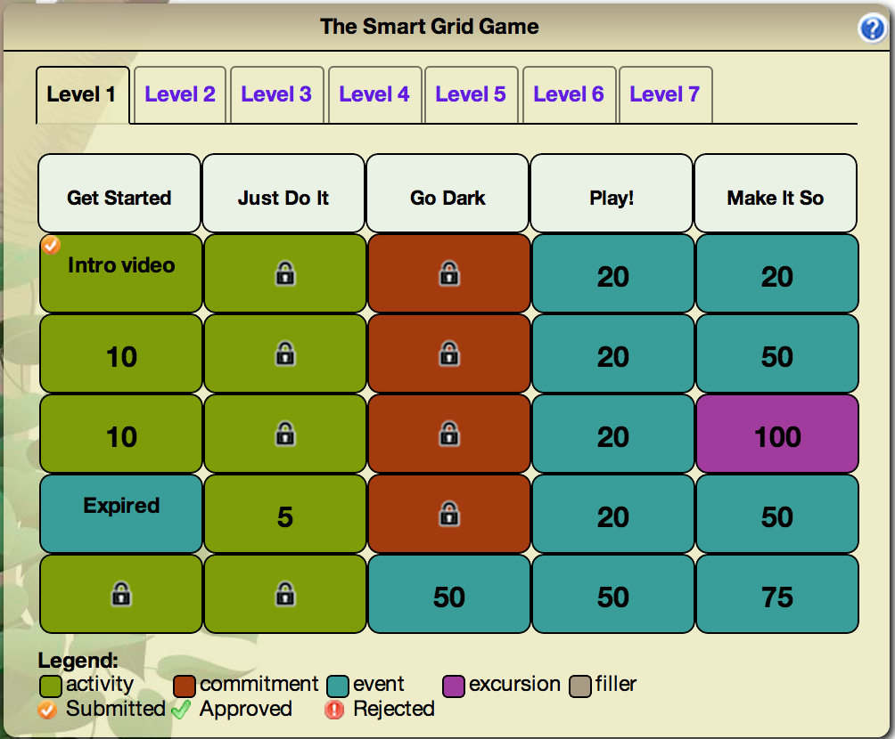
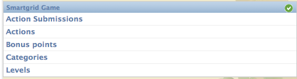
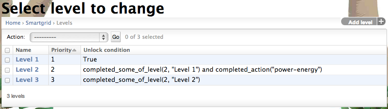
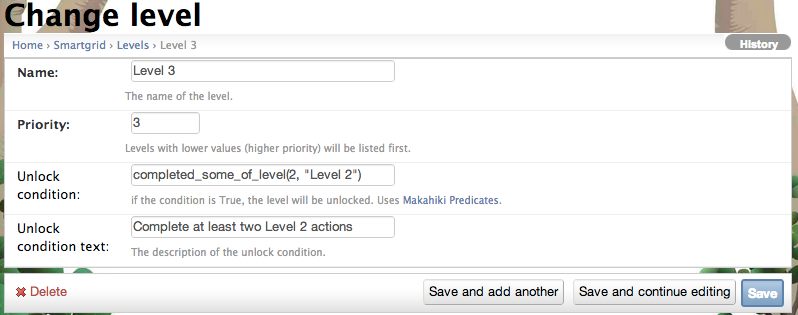
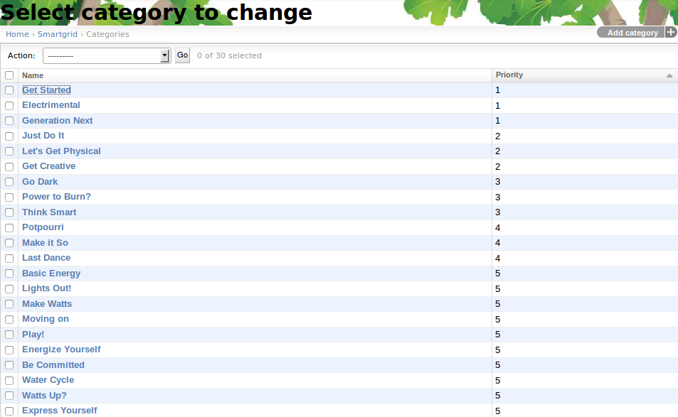
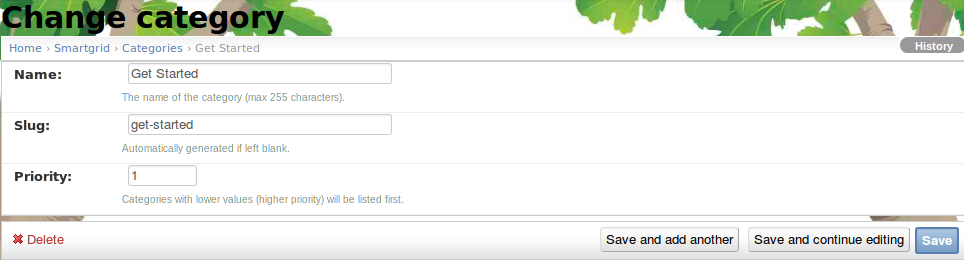
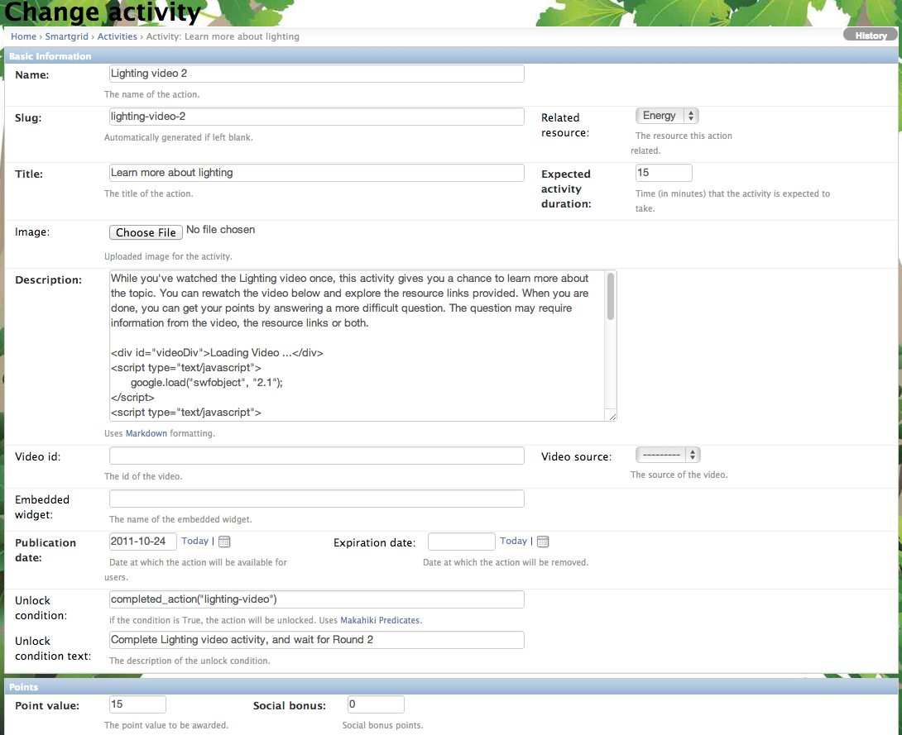
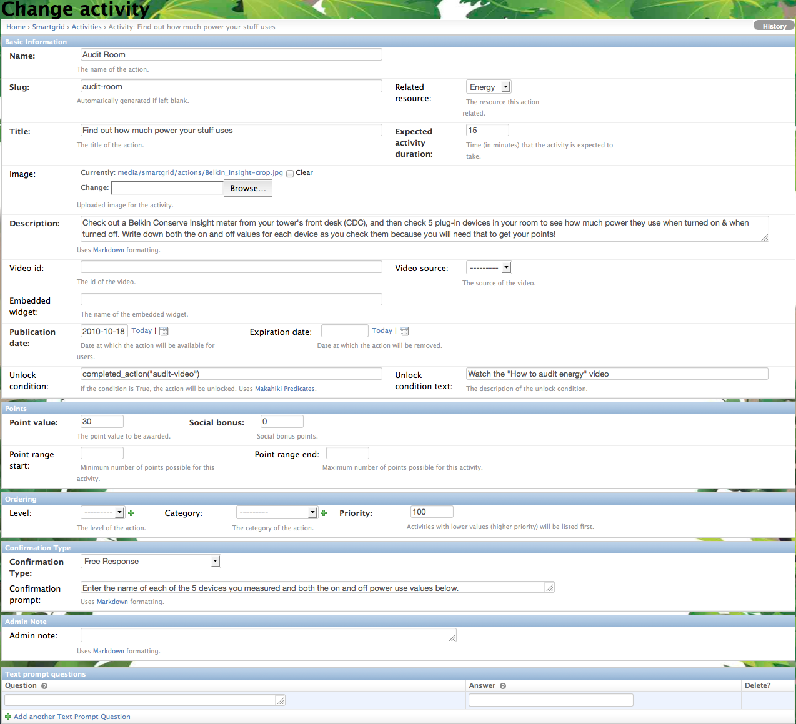
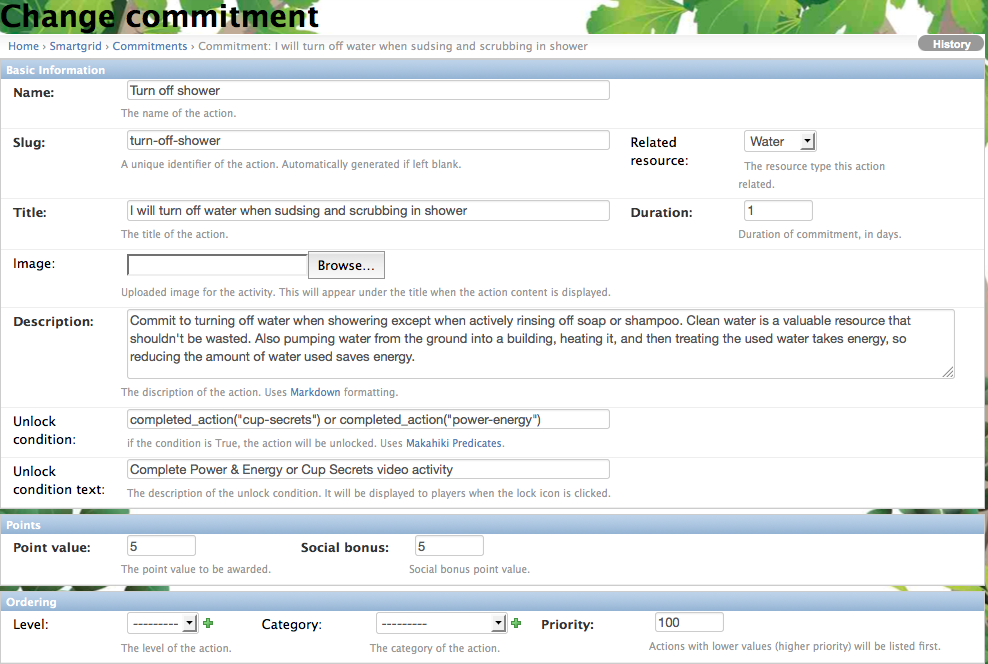

.. _section-configuration-game-admin-smartgrid-game:

Design the Smart Grid Game
==========================

Designing the Smart Grid Game (SGG) is somewhat complicated. You can learn more about the design
of the SGG by reviewing the following two pages:

  * `Introduction to the Smart Grid Game`_
  * `Designing your Smart Grid Game`_

We recommend that you create a design of your SGG using a spreadsheet,
then use the SGG admin widget to implement your design. 

The following screen image shows a typical Smart Grid Game interface:

There are three basic user interface components in the Smart Grid Game:

  * **Levels.**  Each Smart Grid Game can have from 1 to 7 "Levels".  The screen image above
    has 7 levels. Players begin with
    access to the first level.  Additional levels can be unlocked based upon players
    completing lower levels and/or certain dates and times being reached during the
    challenge.

  * **Categories.**  Each Level of a Smart Grid Game has a set of columns, labelled with a
    name corresponding to its category.  In this screen image, the first category is "Get Started", and there are
    five categories total.  Each Level has different category names and can
    even have a different number of categories. 

  * **Actions.**  The cells underneath a category label correspond to "Actions".  There
    are several action types:  Activity, Commitment, Event, Excursion, Video.  In the
    screen image, each of the five categories has five Action cells, so this Level of
    this Smart Grid Game has a total of 25 Actions. 

The following screenshot is an overview of the smart grid game admin widget:

.. _Introduction to the Smart Grid Game: http://www.kukuicup.org/game-mechanics/smart-grid-game
.. _Designing your Smart Grid Game: http://www.kukuicup.org/game-mechanics/smart-grid-game/designing-a-smart-grid-game

Configure the set of levels
---------------------------

The first step is to specify the set of levels in your SGG. 
Click on the "Levels" link in the admin widget, a page similar to the following should appear:

This is the list of levels for the smart grid game. Clicking on the name link will bring up the following screen to edit or change the level:

The name of the level is the label shown in the smart grid game. The priority orders the levels, 
lowest to highest. The unlock condition is a :ref:`section-predicates` that will unlock the level. 
The unlock text is the help text presented to the player explaining what they need to accomplish to 
unlock the level.

You can also click on the "Add level" button in the list page to create a new level.

Configure the Category
----------------------

The next step is to specify the category titles in your SGG. Similar to the  configuration of 
levels, you click the "Categories" link to change an existing category or 
add a new category for the smart grid game.

This is the list of possible categories for the smart grid game. Clicking on the name link, will 
bring up the following screen to edit or change the category, as shown in the following screenshot:

The name is the label used in the smart grid game, the slug is referenced by smart grid actions to 
determine which category the action belongs to. The priority determines how the categories are layed 
out in the smart grid game, lowest to highest.

Configure the set of actions
----------------------------
The next step is to specify the actions for your smart grid game. It is the most complicated and time consuming part, depending on the size and complexity of your smart grid game.

By clicking on the "Actions" link, you will see a page similar to the following:

.. figure:: figs/configuration/configuration-game-admin-smartgrid-game-action-list.png
   :width: 600 px
   :align: center

You can see that the actions are uniquely identified by their slug. They are organized in the order of "Level, Category, and Priority", which corresponding to the layout of the smart grid. You can select (use the checkbox on the left of the action) some actions, then click on the "Action" dropdown, to perform several group operations to the selected actions, such as changing their levels, increase priority etc.

You can also click on the "Slug" link to change the content of the action, as shown in the following screenshot:

Adding an Activity
------------------

You can click on the "Add Activity" button on the top right corner of the page to add a new activity that normally requires player submit the answer and response.

The following page is an example of an activity type action:

Adding an Event/Excursion
-------------------------

You can click on the "Add Event/Excursion" button on the top right corner of the page to add a new event or excursion.

The following page is an example of an activity type action:

.. figure:: figs/configuration/configuration-game-admin-smartgrid-game-event.png
   :width: 600 px
   :align: center

For excursion, the "is excursion" checkbox need to be set.

Adding a Commitment
-------------------

You can click on the "Add Commitment" button on the top right corner of the page to add a new commitment.

The following page is an example of an activity type action:

.. note:: Remember to click the Save button at the bottom of the page when finished to save your changes.

