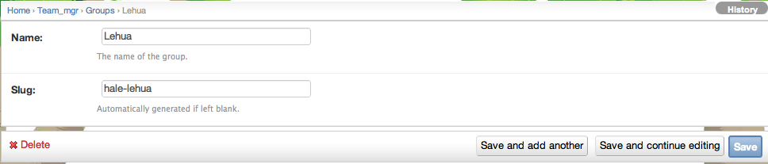

.. _section-configuration-challenge-admin-groups-settings:

Design the groups
=================

About groups
------------

Makahiki defines a three level hierarchy consisting of groups, teams, and players.
  * Groups, which collect together a set of teams. Groups are optional.
  * Teams, which collect together a set of players. Teams are required.
  * Players.

For example, a residence hall challenge might consist of three buildings, each with 10
floors, each floor containing 20 residents.   You could define a single group for each building,
10 teams for each group corresponding to the 10 floors in each building, and 20 players
for each team corresponding to the 20 residents on each floor. Thus, groups correspond to
buildings, teams correspond to floors, and players correspond to residents. 

Note that definition of groups is only needed if you want to have competition at that
level of aggregation.  For example, if in a residence hall competition you are only
competing at the floor level and not the building level, then you can just define players
and teams.  Similarly, if you are only competing at the building level and not the floor
level, then once again you do not need groups (in this case, teams correspond to
buildings).  

The default instance defines some sample groups.

.. note:: Configuration of groups is **required**.  Either you should rename the default
   groups to be named appropriately for your challenge, or else delete them altogether if your
   challenge does not involve competition at the group level.

Getting to the group settings page
----------------------------------

After clicking on the "Groups Settings" link in the Challenge Design page, a page similar to the following should appear:

.. figure:: figs/configuration/configuration-challenge-admin-groups-settings-1.png
   :width: 600 px
   :align: center

In this example, clicking on the "Lehua" instance brings up this page with information about the group.  As you can see, there is not much to provide: the name (which can contain spaces and other punctuation) and the slug (which must be a unique ID). 

.. note:: Remember to click the Save button at the bottom of the page when finished to save your changes. 

