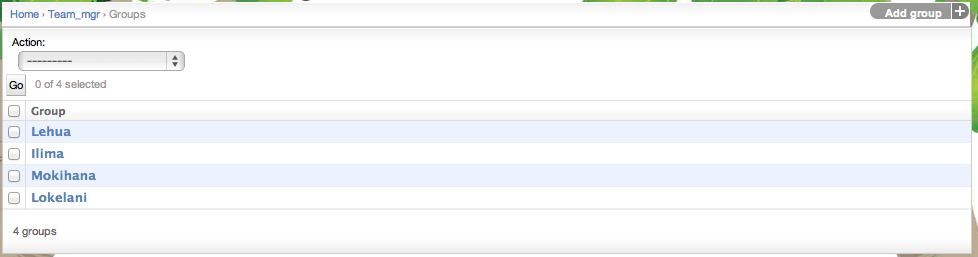

.. _section-configuration-challenge-admin-groups-settings:

Design the groups
=================

After clicking on the "Groups Settings" link in the Challenge Design page, a page similar to the following should appear:

Makahiki defines a three level hierarchy:
  * The first level consists of individual users (players).
  * The second level consists of teams, which are composed of players.
  * The third level consists of groups, which are composed of teams. 

This page allows you to define and manage the highest level of the hierarchy, the groups.  In the demo instance, there are two defined groups: Lehua, and Ilima.

To define a new group, click the "Add group" button in the upper right corner.

Groups are an optional organizational concept in Makahiki.

Configure group settings
------------------------

.. figure:: figs/configuration/configuration-challenge-admin-groups-settings.2.png
   :width: 600 px
   :align: center

In this example, clicking on the "Lehua" instance brings up this page with information about the group.  As you can see, there is not much to provide: the name (which can contain spaces and other punctuation) and the slug (which must be a unique ID). 

The members of a group are specified during team configuration.

.. note:: Remember to click the Save button at the bottom of the page when finished to save your changes. 

