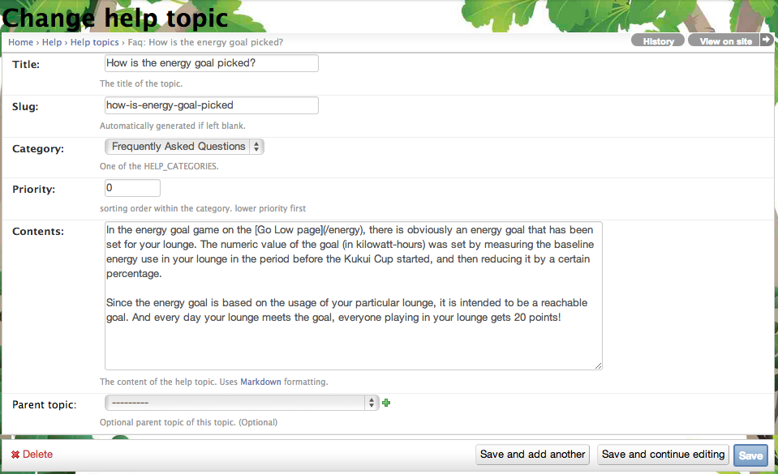

.. _section-configuration-challenge-admin-helptopic-settings:

Design the Help Topics
======================

About the help topics
---------------------

Makahiki includes a set of help contents about the game website, they are presented to players in:

  * A help page that displays the rules of the challenges and frequently asked questions
  * the contextualized help text for each widget when you click on the question mark icon on the top-right corner of each widget.

These help contents are stored in the Makahiki database which could be modified by the challenge desiger.

.. note:: Configuration of the help topic is **optional**, as long as you are satisfied with the default values.

Getting to the help topic settings page
---------------------------------------

After clicking on the "Help topic" link in the Challenge Design page, a page similar to the following should appear:

.. figure:: figs/configuration/configuration-challenge-admin-helptopic-settings-1.png
   :width: 600 px
   :align: center

These are the default help topics created as part of the system initialization process. Click on this link to bring up the following page that enables you to change the individual help topic:

You can also click on the "Add help topic" button to add a new help topic.

.. note:: Remember to click the Save button at the bottom of the page when finished to save your changes.

