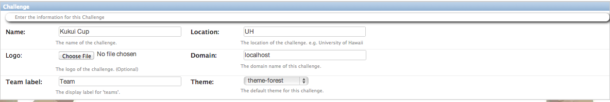
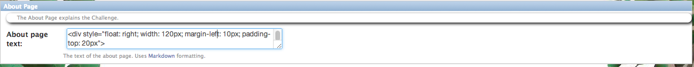
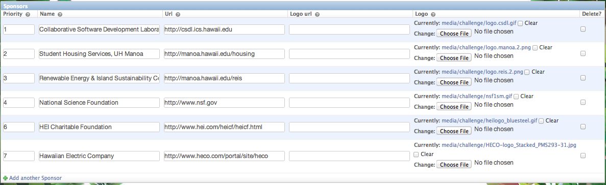

.. _section-challenge-name-settings:

Design the global settings
==========================

About global settings
---------------------

Makahiki challenges have a few global properties: the name of the challenge, the logo that
appears on all pages, and so forth.  Also included in the global settings is the text that
appears on a few static pages: the Landing Page, About page, and so forth. 

Getting to the global settings page
-----------------------------------

Clicking on `Global settings` within the Challenge Design Page brings up a page with
sections allowing you to specify some global properties of your challenge.

Specify the name, logo, etc.
----------------------------

The first section of the page enables you to configure the basic identify of your challenge: its
name, logo, and so forth. 

.. note:: Configuration of this section is **optional**, if you are satisfied with the
   default values. 

Makahiki uses the Name field and the Logo to brand the Challenge.  They appear on the
Left-hand side of the navigation bar of each page.  The domain is used to in the
Attendance and Bonus Codes to create the URL the player uses to collect their points. The
Team label is used in several widgets, such as energy scoreboard.  The Theme is the
default theme for the Challenge.

Specify the Landing page text
-----------------------------

This form enables you to customize the text that appears on the Landing Page. 

.. note:: Configuration of this section is **optional**, if you are satisfied with the
   default values. 

.. figure:: figs/configuration/configuration-challenge-design-landing-page.png
   :width: 600 px
   :align: center

The system is initialized with text appropriate to the Kukui Cup challenge at the
University of Hawaii.  You should change this to reflect your own challenge circumstances.

Specify the About page text
---------------------------

This form enables you to customize the text that appears on the About Page.

.. note:: Configuration of this section is **optional**, if you are satisfied with the
   default values. 

Specify the sponsors
--------------------

This form enables you to  specify the Sponsors that appear on the Landing page.

.. note:: Configuration of this section is **optional**, if you are satisfied with the
   default values. 

