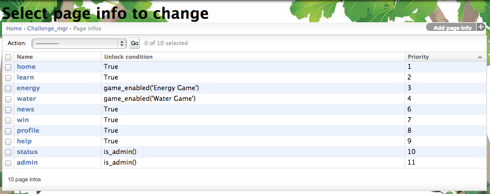
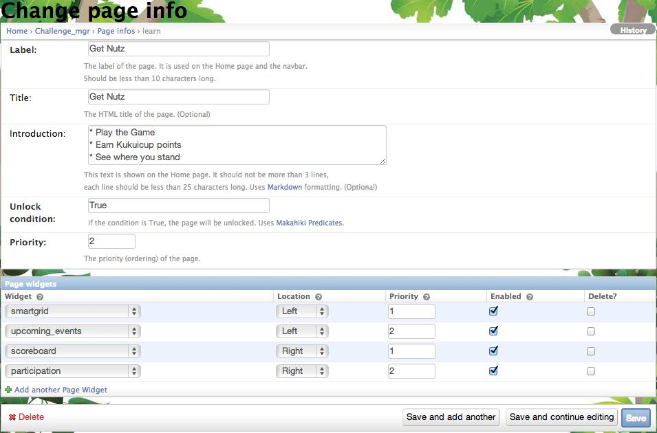

.. _section-configuration-challenge-admin-pageinfo-settings:

Design the Pages
================

About the page
--------------

Makahiki defines a default set of pages for the game website. A page is associated with a nagivation icon and label on the top of the website interface, the icon and introduction text on the website home page, a condition for displaying and hiding the page, as well as the game widgets on the page.

.. note:: Configuration of the page is **optional**, as long as you are satisfied with the default values.

Getting to the page settings page
---------------------------------

After clicking on the "Page info" link in the Challenge Design page, a page similar to the following should appear:

These are the default page info created as part of the system initialization process. Click on this link to bring up the following page that enables you to configure the individual page:

You can also click on the "Add page info" button to add a new page. If you like to add a new page, you will need to contact the developer to supply a new set of icons for your new page, as well as other development changes to support the new page.

.. note:: Remember to click the Save button at the bottom of the page when finished to save your changes.

