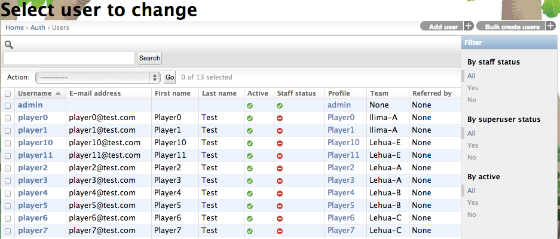

.. _section-configuration-challenge-admin-players-settings:

Set up the player roster
========================

Adding new player(s)
--------------------

After clicking on the "Users" link in the Challenge Design, a page similar to the following should appear:

To add a new player, click the "Add user" button in the upper right corner. To load a list of users defined in a csv file, the "Bulk create users" button could be used, which will prompt you to upload a csv file from your local computer.

The format of the csv file is as follows::

    team, firstname, lastname, email, username, password

When a new player is created, a "Profile" is also created for this player, as shown in the "Profile" link in the list. The Profile has more detailed information about the player, such as the display name, team which this player belongs to, and the contact info etc.

The following screen shows an example of a player's profile settings looks like:

.. figure:: figs/configuration/configuration-challenge-admin-players-settings.2.png
   :width: 600 px
   :align: center

Changing an existing player
---------------------------

Clicking on the "username" link brings up a page to modify the basic information of the player.

Changing the Profile of an existing player
------------------------------------------

Clicking on the "profile" link brings up a page to modify the  profile information of the player.

.. note:: Remember to click the Save button at the bottom of the page when finished to save your changes.

