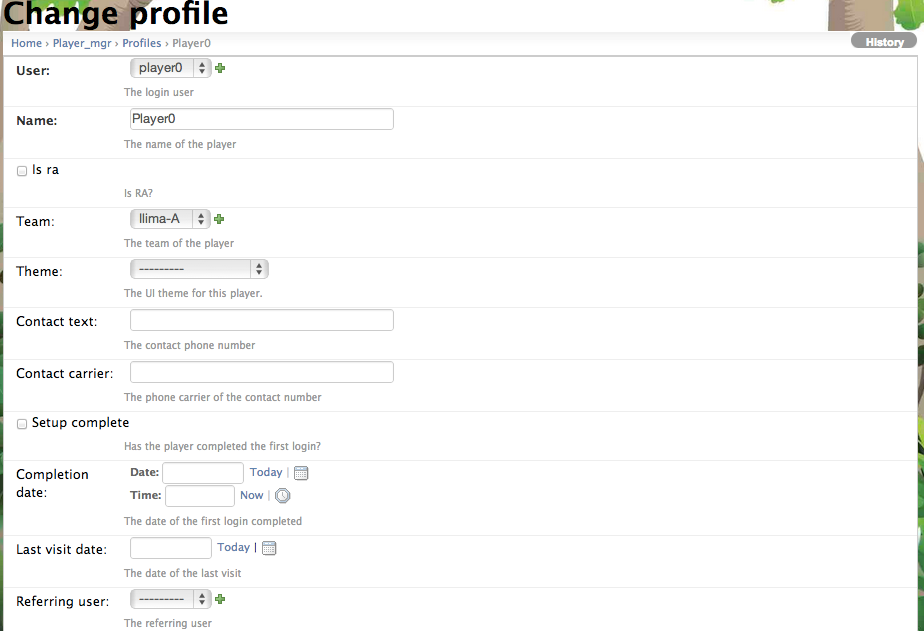

.. _section-configuration-challenge-admin-players-settings:

Set up users
============

About users
-----------

Makahiki supports the following types of users:

  * **Player**.  These are the most common type of users who actually play the challenge.
    All challenges must have some players.

  * **Admin**.  The admin user has access to the Settings and Status page, and has the
    ability to configure, design, and manage the challenge.
    All challenges must have at least one Admin.

  * **RA**.  This is a special-purpose role provided for dorm energy challenges, where 
    you might wish special capabilities or game mechanics for RAs.  
    The RA role is optional for challenges.

As part of the installation process (see :ref:`section-installing-makahiki`), 
you create an environment variable that defines an initial admin account and username. As
a result, every Makahiki installation has at least one admin account.  After logging in
with this account, it is possible to use this page to create additional users and provide
them with admin status.  This is quite desirable in order, for example, to distribute the workload of
processing Smart Grid Game submissions.

In addition to defining additional admin accounts, the other primary purpose of this page is to
create accounts for all players of a challenge.  *In the current version of Makahiki, the
administrator must define all player accounts; it is not possible for users to "register"
themselves online and obtain an account to play.*  

Creating a player requires providing their name, their account name, and the team to which
they belong. You can do this individually, or if you need to define many players, you can
create and upload a file.

.. note:: Configuration of users is **required**.  At a minimum, you must delete the
   default users and add new users corresponding to the players in your challenge.

Getting to the users page
-------------------------

After clicking on the "Users" link in the Challenge Design, a page similar to the following should appear:

.. figure:: figs/configuration/configuration-challenge-admin-players-settings-1.png
   :width: 600 px
   :align: center

To add a new player, click the "Add user" button in the upper right corner. 

Defining multiple users through file upload
-------------------------------------------

To load a list of users defined in a csv file, the "Bulk create users" button could be used, which will prompt you to upload a csv file from your local computer.

The format of the csv file is as follows::

    team, firstname, lastname, email, username, password

About the user profile
----------------------

When a new user is created, a "Profile" is also created for this user, as shown in the "Profile" link in the list. The Profile has more detailed information about the user, such as the display name, team which this user belongs to, and the contact info etc.

The following screen shows an example of a player's profile settings looks like:

Changing the information associated with an existing user
---------------------------------------------------------

Due to Django, Makahiki stores information about a user in two places:

  *  Click on the "username" link to bring up a page to modify basic information about the user. 
  *  Click on the "profile" link to bring up a page to modify additional information about the user.

.. note:: Remember to click the Save button at the bottom of the page when finished to save your changes.

