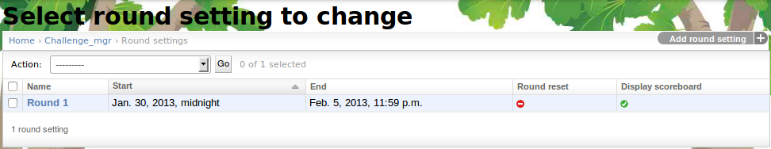
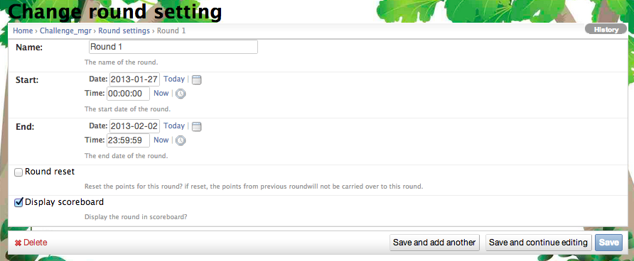

.. _section-configuration-challenge-admin-round-settings:

Design the rounds
=================

About rounds
------------

Makahiki requires all challenges to have a start date when players can begin logging in to
the system and engage in activities, and an end date when the challenge is over and prizes
are awarded. In addition, Makahiki allows you to partition the overall challenge into a
sequence of "sub-challenges" which can potentially have their own points, prizes, and
activities.  These capabilities are provided by the "Round" mechanism.

The simplest approach is to define a single round for your challenge.  In this case, the start and end dates of
the challenge as a whole correspond to the start and end dates of that round.  

Alternatively, you could define a challenge with 2, 3, or more rounds.   The 2011
University of Hawaii Kukui Cup contained three rounds, each approximately 1 week in
length.  The 2012 University of Hawaii Kukui Cup contained 5 rounds, varying in length
from 2 weeks to 3 months.  

The basic reason for defining multiple rounds is to enable players to join the challenge
"late" and still feel like they can compete with other players.   To facilitate this, you
can specify that a round (and its prizes) depend upon only the points accumulated during
that round.  

Rounds cannot overlap in time. If you try to define a new round that overlaps in time with
a pre-existing round, then the system will signal an error. 

Rounds also serve another important purpose: they define the time intervals during which
players are allowed to login to the system.  (Administrators can log in to the
system at any time that the system is up.)

It is possible to define rounds such that there are "non-round periods" between the end
of one round and the start of another. For example, you could design a challenge in which
Round 1 ends on March 15 and Round 2 starts five days later on March 20.  The days
between those two rounds create a "blackout" period when players are not able to login to
the system.

.. note:: Configuration of the round(s) corresponding to a challenge is **required**.  At
   a minimum, the round specification provided in the default configuration must be edited
   to provide the start and end dates for your challenge. 

Getting to the round settings page
----------------------------------

After clicking on the "Round Settings" link in the Challenge Design page, a page similar to the following appears:

In this example, one round is specified.  To create a new round, click on the "Add round setting" in the upper right corner. 

Configure a round
-----------------

Clicking on a round name takes you to a page containing a form that allows you to edit the round attributes or delete the round entirely. 

.. note:: Remember to click the Save button at the bottom of the page when finished to save your changes. 

