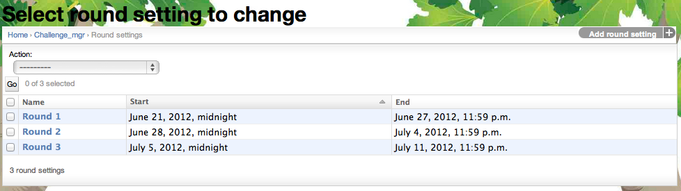
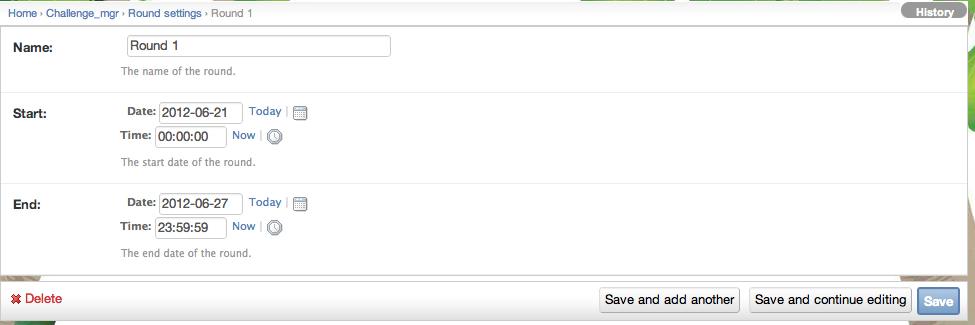

.. _section-configuration-challenge-admin-round-settings:

Design the rounds
=================

After clicking on the "Round Settings" link in the Challenge Design page, a page similar to the following should appear:

All challenges must contain at least one round, and can have as many rounds as desired.   The rounds basically provide the concept of a time interval at the end of which prizes are awarded or some finalization of the challenge occurs.  

In this example, one round is specified.  To create a new round, click on the "Add round setting" in the upper right corner. 

Configure a round
-----------------

Clicking on a round name takes you to a page containing a form that allows you to edit the round attributes or delete the round entirely. 

.. note:: Remember to click the Save button at the bottom of the page when finished to save your changes. 

