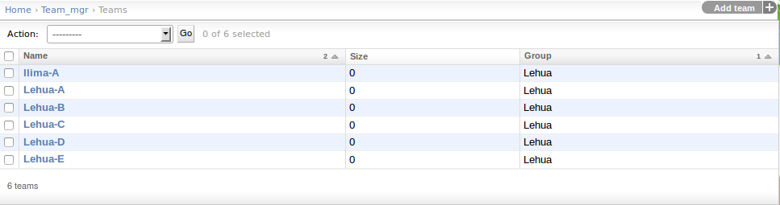
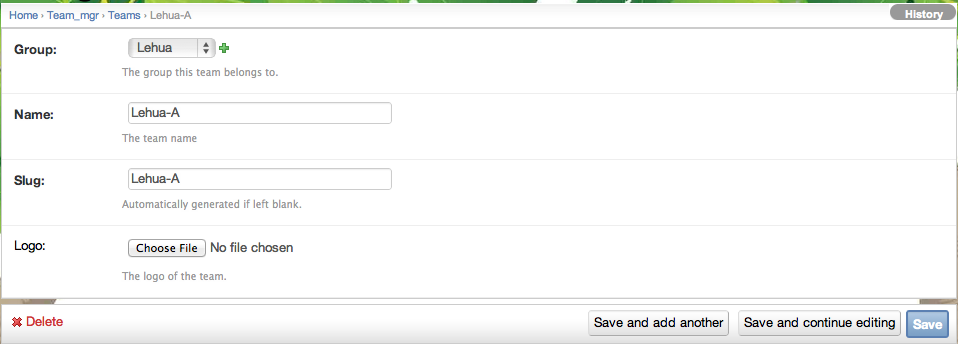

.. _section-configuration-challenge-admin-teams-settings:

Design the teams
================

About teams
-----------

Makahiki defines a three level hierarchy consisting of groups, teams, and players.
  * Groups, which collect together a set of teams. Groups are optional.
  * Teams, which collect together a set of players. Teams are required.
  * Players.

For example, a residence hall challenge might consist of three buildings, each with 10
floors, each floor containing 20 residents.   You could define a single group for each building,
10 teams for each group corresponding to the 10 floors in each building, and 20 players
for each team corresponding to the 20 residents on each floor. Thus, groups correspond to
buildings, teams correspond to floors, and players correspond to residents. 

All players are required to be associated with a Team.  This constraint might be removed in a
future release of the system.

.. note:: Configuration of teams is **required**.  At the very least, you should rename
   the two teams to fit your challenge.  You might also need to define more than two teams.

Getting to the team settings page
---------------------------------

After clicking on the "Teams Settings" link in the Challenge Design page, a page similar to the following should appear:

To define a new team, click the "Add team" button in the upper right corner. To edit a
team definition, click the link which brings up a page similar to the following:

Normally, you can leave the team size as 0. An experimental feature of Makahiki is to specify a non-zero size for each team. By specifying a non-zero team size for each team, the system will use the team size to normalize the participations rate, total team points across different teams.

.. note:: Remember to click the Save button at the bottom of the page when finished to save your changes. 

