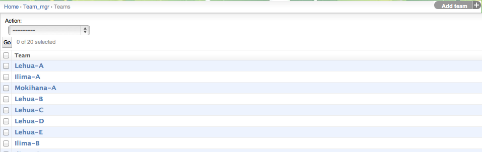

.. _section-configuration-challenge-admin-teams-settings:

Design the teams
================

After clicking on the "Teams Settings" link in the Challenge Design page, a page similar to the following should appear:

Makahiki defines a three level hierarchy:
  * The first level consists of individual users (players).
  * The second level consists of teams, which are composed of players.
  * The third level consists of groups, which are composed of teams. 

This page allows you to define and manage the second level of the hierarchy, the teams.  In the demo instance there are six teams defined.

To define a new team, click the "Add team" button in the upper right corner.

Teams are a required organizational concept in Makahiki.

Configure team settings
-----------------------

.. figure:: figs/configuration/configuration-challenge-admin-teams-settings.2.png
   :width: 600 px
   :align: center

In this example, clicking on the "Lehua-A" instance brings up this page with information about the team.  As with groups, you must provide a name and a slug (unique ID).  In addition, you specify the group to which this team belongs. 

.. note:: Remember to click the Save button at the bottom of the page when finished to save your changes. 

