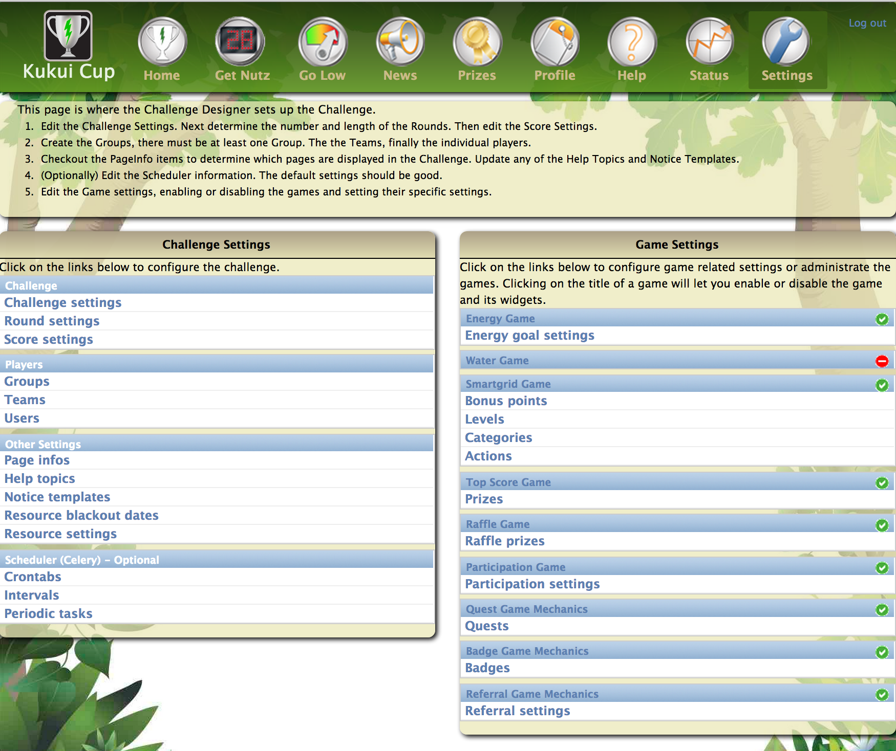

.. _section-challenge-design:

Challenge Design
================

Along with specifying authentication, wattdepot, and email configuration (see
:ref:`section-site-configuration`), you must also design the specific nature of your
challenge.  Go to the Settings Page (see :ref:`section-configuration-settings-page`), and
click on the Challenge Design button to retrieve the following page:

As you can see, the page consists of two sections, "Challenge Settings" and "Game
Settings".  Challenge settings enables you to set the global properties of the challenge
(rounds, scores, users, etc.), while Game Settings enables you to configure the specific
games to appear in the challenge and their properties. 

Challenge Settings
------------------

The following sections document the settings accessable from the "Challenge Settings" widget.

.. toctree::
   :maxdepth: 1

   challenge-design-name-settings
   challenge-design-round-settings
   challenge-design-score-settings
   challenge-design-groups-settings
   challenge-design-teams-settings
   challenge-design-players-settings
   challenge-design-scheduler-settings

Game Design Settings
--------------------

The following sections document the settings accessable from the "Game Settings" widget.

.. toctree::
   :maxdepth: 1

   challenge-design-game-admin-enable-disable
   challenge-design-game-admin-resource-game
   challenge-design-game-admin-smartgrid-game
   challenge-design-game-admin-topscore-game
   challenge-design-game-admin-raffle-game
   challenge-design-game-admin-participation-game
   challenge-design-game-admin-quest
   challenge-design-game-admin-badge
   challenge-design-game-admin-referral

