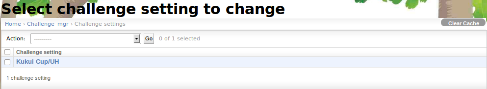
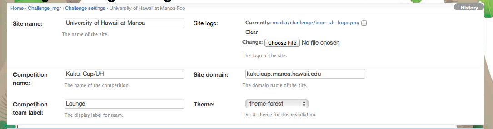
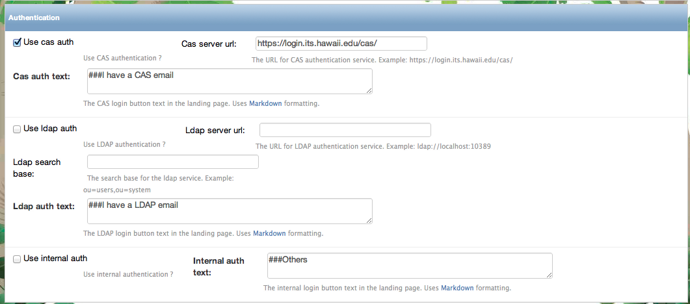
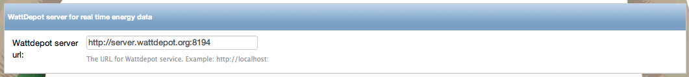
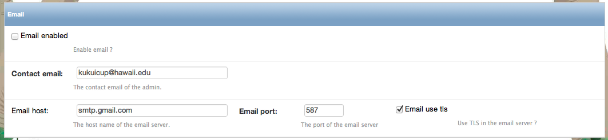
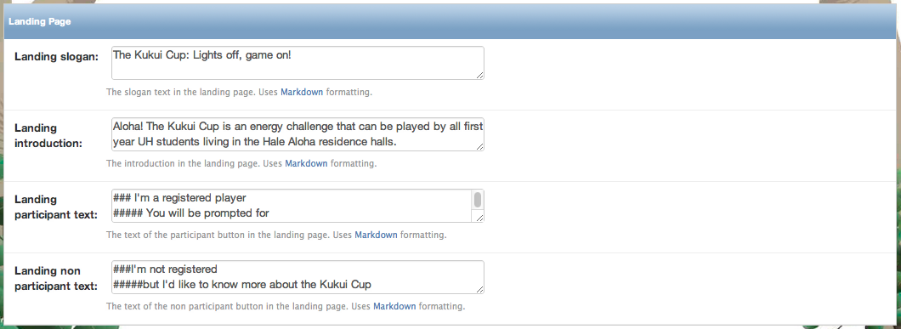
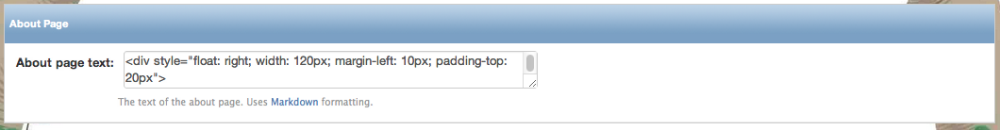
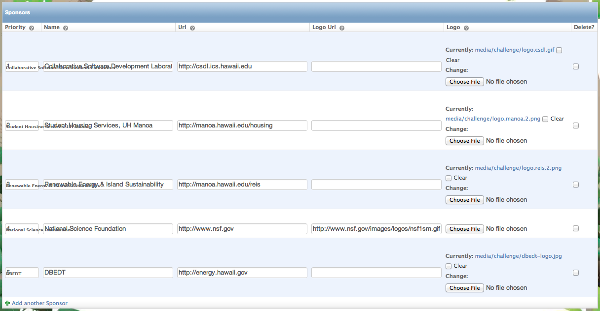

.. _section-configuration-challenge-admin-challenge-settings:

Challenge Settings Page
=======================

Select challenge setting
------------------------

Under normal circumstances, there is only one challenge instance per system.  By default, this is called "University of Hawaii at Manoa".  Select this instance; you will be able to change its name below.

The following sections detail each part of the page that appears after selecting "University of Hawaii at Manoa".   

Configure names
---------------

This section of the page enables you to change the name of the site, the logo, the competition name, the team label, the domain, and the default theme.  

Configure authentication
------------------------

Makahiki supports three types of authentication:  CAS, LDAP, and internal (Django) authentication. 
Use the checkboxes to specify which single or combination of authentication strategies you would like to use.  For those that are selected, provide the configuration parameters.

Configure WattDepot server
--------------------------

If you have installed energy meters and want automated collection of energy data for use in the Daily Energy Goal Game (and the Power Meter widget), then you must also install WattDepot and 
provide the URL here.  

Configure email
---------------

It is important to enable email so that the "Send Feedback" button and email-based reminders for users work.   Provide the information here.

Configure landing page
----------------------

This section allows you to edit the text on the landing page to refer to your specific challenge.

Configure about page
--------------------

This section allows you to change the About page to refer to your specific challenge. 

Configure sponsors
------------------

If you have sponsors for your challenge, you can specify their names and logos and they will appear on the landing page. 

Click "Save" when finished
--------------------------

Remember to click the Save button at the bottom of the page when finished to save your changes. 

