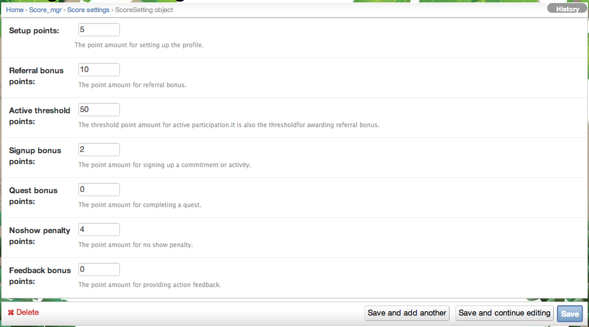

.. _section-configuration-challenge-admin-score-settings:

Score Settings Page
===================

Select score settings
---------------------

After clicking on the "Score Settings" link in the Challenge Admin widget, a page similar to the following should appear:

.. figure:: figs/configuration/configuration-challenge-admin-score-settings.1.png
   :width: 600 px
   :align: center

All challenges must contain exactly one score settings object, which should be automatically created as part of the system initialization process.

Configure score settings
------------------------

Clicking on the "Score Settings" instance takes you to a page where you can configure the number of points earned by players for various actions. 

Click "Save" when finished
--------------------------

Remember to click the Save button at the bottom of the page when finished to save your changes. 

