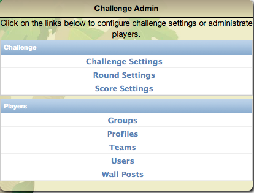

.. _section-configuration-challenge-admin:

Challenge Admin Configuration Widget
====================================

The Challenge Admin Configuration Widget provides access to pages to support "global"
properties of the challenge.  The pages relevent to configuring a challenge are documented below:

.. toctree::
   :maxdepth: 2

   configuration-challenge-admin-challenge-settings
   configuration-challenge-admin-round-settings
   configuration-challenge-admin-score-settings
   configuration-challenge-admin-groups-settings
   configuration-challenge-admin-teams-settings

The Profiles, Users, and Wall Posts pages are documented in :ref:`section-execution`.

