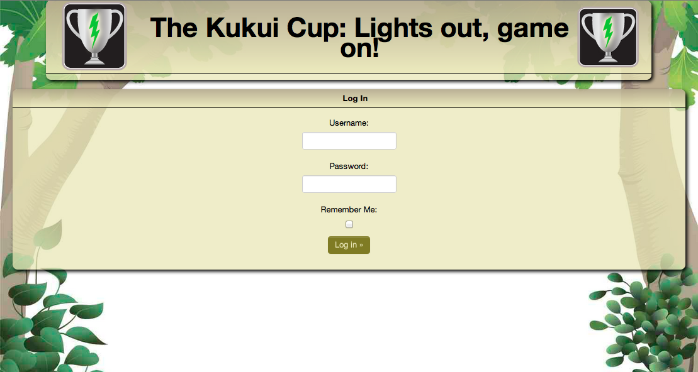
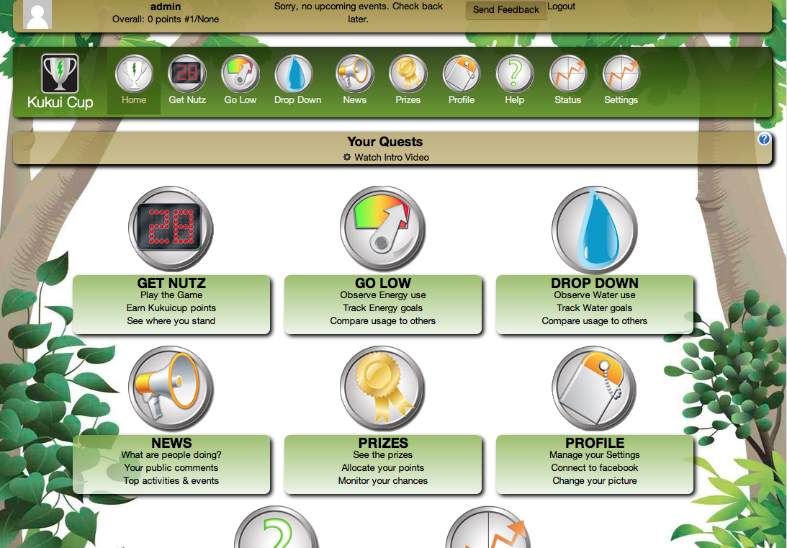
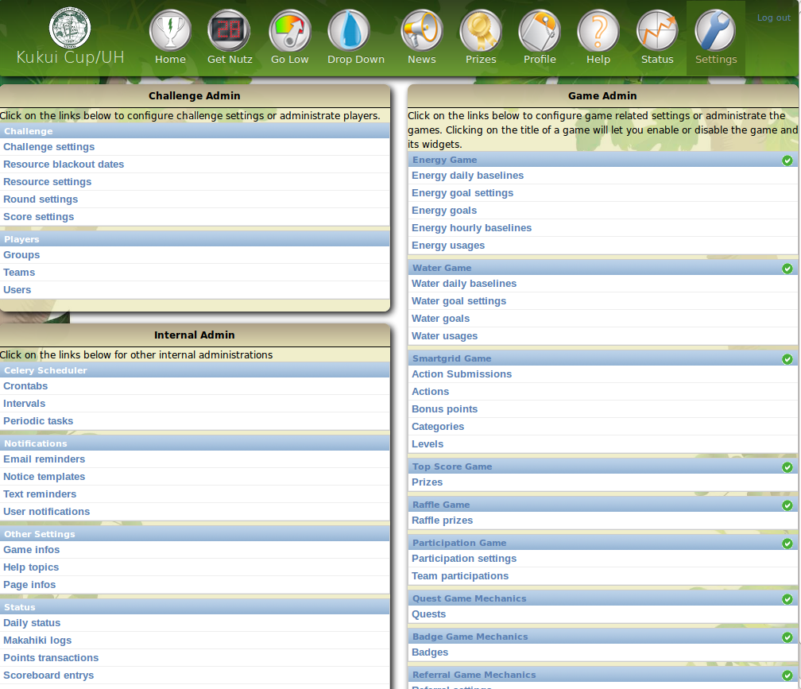

.. _section-configuration-settings-page:

Retrieve the Settings Page
==========================

In order to accomplish any online administrative tasks, you must:

  * Login with an account that has administrator privileges
  * Navigate to the "Settings" page, from which you can eventually get to the
    administrative page of interest. 

.. note:: In addition to the online administrator interface, there are also administative
   capabilities available through the command line.  These are
   documented in :ref:`section-developer-guide-management-commands`.

Log in as admin
---------------

To login as an administrator, go to the internal (Django) login page at: http://127.0.0.1:8000/account/login:

Use the credentials you specified in the MAKAHIKI_ADMIN_INFO environment variable. 

Upon successful login, you will be taken to the home page:

Note that admin accounts have two additional pages displayed in the Nav Bar:  "Status" and
"Settings".  "Status" provides real time analytics for use in managing a running
competition, as detailed in :ref:`section-challenge-management`.

Click on Settings page icon
---------------------------

Click on the Settings icon in the Nav Bar to go to the Settings page:

This page presents a set of buttons providing access to different administrative areas
depending upon the type of task to be accomplished.  These correspond roughly to the
Makahiki "life-cycle phases" described in :ref:`section-site-administration-guide`.

