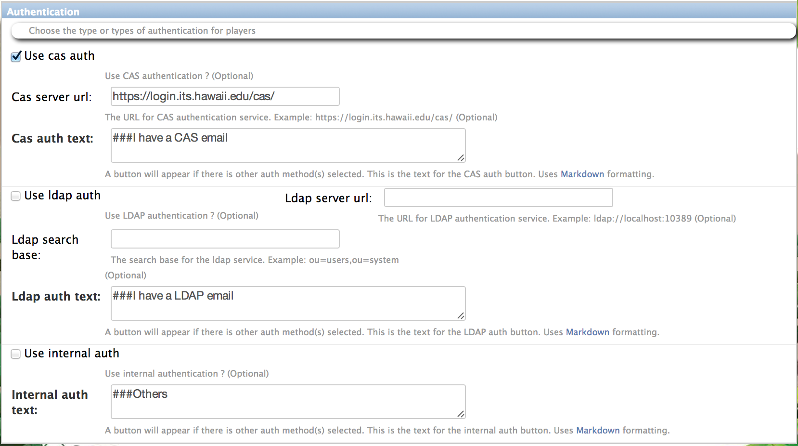

.. _section-configuration-system-administration-authentication:

Configure authentication
========================

About authentication
--------------------

In Makahiki, "authentication" refers to the way in which a player logs in to participate
in a challenge.  In Makahiki, there is currently no way for people to "register"
themselves and obtain an account to play a challenge.  Instead, the administrator must
configure the system in advance of the challenge with the names of all potential players,
and the teams to which they are assigned.  (This constraint could be removed in a future
release.)

Given that the system knows in advance the identities of all potential players of a
challenge, the next question is how to verify that a given online user is one of these
potential players?  That is the goal of authentication, and Makahiki provides a variety of
ways to do it. 

.. note:: Authentication is **required** in Makahiki.  If you want the simplest
   authentication to configure, do internal authentication. However, that means your users
   will have a separate account and password for the challenge, which is a barrier to participation.

Getting to the authentication page
----------------------------------

From the Settings Page, click on the System Administration button to retrieve the following
authentication configuration form:

Makahiki currently supports three kinds of authentication: CAS, LDAP, and the
internal authentication provided by Django.   System administrators must configure at
least one form of authentication, though multiple forms are also acceptable.

CAS authentication
------------------

To use CAS authentication, you can check the "**Use cas auth**" checkbox, and fill in the "**Cas server url**" field. The url is where users access the CAS authentication service, for example, https://login.its.hawaii.edu/cas

You may want to check with the system admin of your organization's CAS service provider to obtain the url of the service.

You can also modify the CAS login button text by changing the "**Cas auth text**" field. This text will display as the button text associated with the CAS authentication in the Landing page.

LDAP authentication
-------------------

.. note:: Currently Makahiki only support LDAP authentication in local installation. Because the python-ldap software package can not be installed on the Heroku environment (as of this writting), the LDAP authentication of Makahiki is not supported on Heroku.

To use LDAP authentication, you can check the "**Use ldap auth**" checkbox, and fill in the following additional fields:

   1. "**Ldap server url**": The url is where users access the LDAP authentication service, for example, ldap://ldap.hawaii.edu:389. You may want to check with the system admin of your organization's LDAP service provider to obtain the url of the service.
   2. "**ldap search base**": It is the base entry for the ldap authentication search operation. For example, if all the users in the LDAP directory are located under "ou=users,ou=system", then the search base will be "ou=users,ou=system".  Again, your organization's LDAP service admin will be able to provide this information.

You can also modify the LDAP login button text by changing the "Ldap auth text" field. This text will display as the button text associated with the LDAP authentication in the Landing page.

Additionally, in order to use LDAP authentication in Makahiki, You need to install the following two software packages in your local virtual environment::

    % pip install python-ldap
    % pip install django-auth-ldap

They provides client APIs for Makahiki to access an LDAP directory server.

After the ldap package are installed, you will need to set the following environment variable to enable LDAP authentication::

    % export MAKAHIKI_LDAP_BIND_DN = <bind_dn>
    % export MAKAHIKI_LDAP_BIND_PASSWORD = <bind_password>

The <bind_dn> is the DN of the special ldap user that have the privilege to bind to and search the ldap directory. <bind_password> is the password of the above special ldap bind user.

By default, if LDAP auth is used, the Makahiki use the ldap user's "**uid**" attribute as the username to login and authenticate. If your organization's LDAP server use "**cn**" as the unique user identifier, you can set the following environment variable to let Makahiki use the ldap user's "**cn**" attribute as the username to login::

    %export MAKAHIKI_LDAP_USE_CN = True

After the environment variables are set, the server restart is needed to take into effect for the LDAP configurations.

Internal authentication
-----------------------

To use the built-in Django internal authentication, you can check the "**Use internal auth**" checkbox.

You can also modify the internal login button text by changing the "Internal auth text" field. This text will display as the button text associated with the internal authentication in the Landing page.

