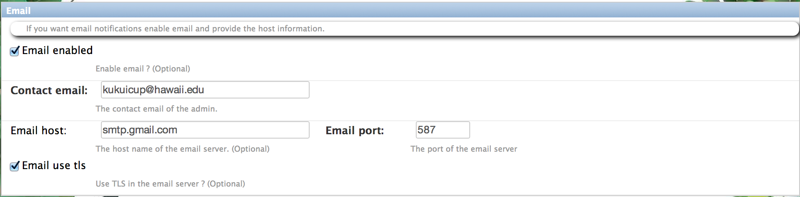

.. _section-configuration-system-administration-email:

Configure email
===============

About email
-----------

Makahiki uses email in the following ways:

  * Players can elect to be "reminded" about activities they wish to attend.  Email is one communication option 
    provided.

  * Makahiki can automatically notify players via email if they have won a prize in the Top Score game
    or the Raffle Game after a round is over.

  * When an activity submission is rejected, an notification email will be sent to the player.

  * Players can send feedback and ask questions to the system admin in Makahiki, they will be sent via email to the Makahiki system admin.

  * Other system generated email reminders from Makahiki to players.

.. note:: Configuration of email for use in a Makahiki challenge is **optional**.  
   However, if you do not enable email, then these communication mechanisms will not be available to
   players and administrators. 

Getting to the email configuration page
---------------------------------------

From the Settings Page, click on the System Administration button to retrieve the following
Email configuration form (it occurs below the WattDepot configuration form):

Configuring email
-----------------

To enable the email, you can check the "**Email enabled**" checkbox, and fill in the following fields:

  1. "**Contact email**": It is the email of the system admin that user's feedback or questions will be sent to, or any system generated error messages will be sent to.
  2. "**Email host**": It is the host name of the email server. for example, smtp.gmail.com
  3. "**Email port**": It is the port of the email server.
  4. "**Email use tls**": check this if the email server use TLS.

Additionally, you will need to set the following environment variables in order to complete the email configuration::

  % export MAKAHIKI_EMAIL_INFO=<email_user_name>:<password>

On Heroku, you can set the environment variable using::

  % heroku config:add MAKAHIKI_EMAIL_INFO=<email_user_name>:<password>

This is the credential of the user that can use the email server configured above. The reason to separate port of the email configuration into environment variable is to avoid putting the credential information in the database.

After the environment variable is set, you will need to restart the server.