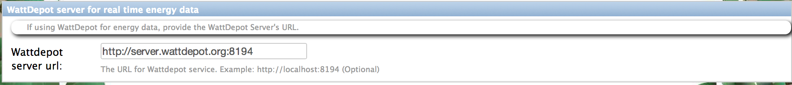

.. _section-configuration-system-administration-wattdepot:

Configure WattDepot
===================

About WattDepot
---------------

WattDepot is a software service for collecting, storing, analyzing, and visualizing energy
data.  One of the capabilities of Makahiki is the display of power being consumed by a
team in near real-time, and a record of the amount of power that a team consumed during a
challenge.   Rather than build into Makahiki support for all the various kinds of power
meters and protocols available on the market in order to provide this capability, Makahiki
delegates this responsibility to the WattDepot system, which is designed specifically to
solve this problem.  

.. note:: Configuration of WattDepot for use in a Makahiki challenge is **optional**.  For example, if you do not want to
   display power consumption in near real-time, and if you are content to manually enter
   energy consumption data by each team on a daily basis during the challenge, then you do
   not have to install WattDepot and configure Makahiki to access energy data from it. 

Getting to the WattDepot configuration page
-------------------------------------------

From the Settings Page, click on the System Administration button to retrieve the following
WattDepot configuration form (it occurs below the Authentication form):

Configuring WattDepot
---------------------

WattDepot configuration is only necessary if you wish to provide near real-time energy
data to players in the challenge. 

The configuration setting is rather simple: just the URL to the WattDepot server.
However, for WattDepot integration with Makahiki to occur successfully, the following
additional constraints must be met:

* Currently, Makahiki uses the name of a team as name of the Wattdepot source to retrieve the energy data for the team. This requires that the name of the team need to be the same as the source name in Wattdepot. Otherwise, Makahiki will not be able to retrieve the team's energy data. This limitation may be resolved in the future release of Makahiki.

