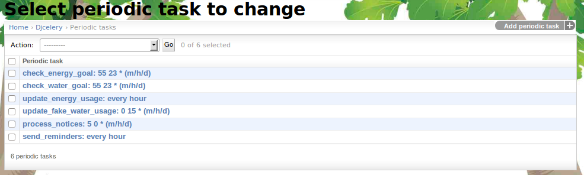

.. _section-configuration-challenge-admin-scheduler-settings:

Design periodic tasks
=====================

About periodic tasks
--------------------

Various games and game mechanics in Makahiki depend upon periodic updates to the system
state.  For example, the Energy Goal game requires the system to update the state of a
team's progress toward achieving its daily energy goal once an hour. If students have
requested a reminder regarding an event, the system must send that reminder at the
prescribed amount of time before the event occurs.   

Makahiki provides a "periodic task" system to support the needs of various games and game
mechanics to invoke a specific behavior regularly.  

Whether or not you need to configure periodic tasks depends upon the specific games and
game mechanics you are providing in your challenge.   

Getting to the periodic tasks page
----------------------------------

After clicking on the "Periodic Task Settings" link in the Challenge Design page, a page similar to the following should appear:

This table lists all the defined Periodic Tasks, such as checking the Energy Goals. You may enable, disable, and create new periodic tasks.

Configure a periodic task
-------------------------

.. figure:: figs/configuration/configuration-challenge-admin-scheduler-settings-2.png
   :width: 600 px
   :align: center

Clicking on a task name takes you to a page containing a form that allows you to edit the
task attributes or delete the task entirely. The important fields are Name - The name of
the task you see in the list. Task name - This is the function that is run. In this
example 'apps.widgets.resource_goal.tasks.check_energy'.  The "Interval" or "Crontab"
fields determine when Makahiki runs the task. In this case it is run every day at
23:55. If the task needs parameters supply them in the Arguments field. Check or uncheck
the Enabled field to turn the task on or off.

.. note:: Remember to click the Save button at the bottom of the page when finished to save your changes. 

