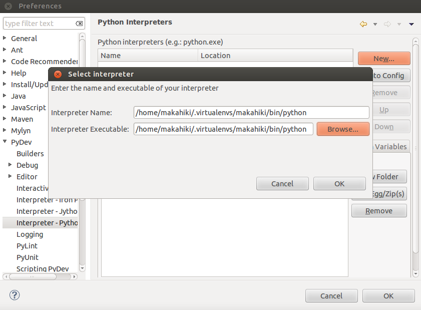
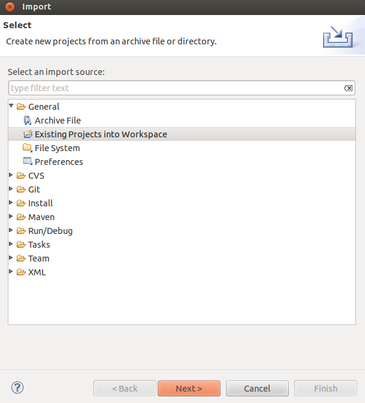
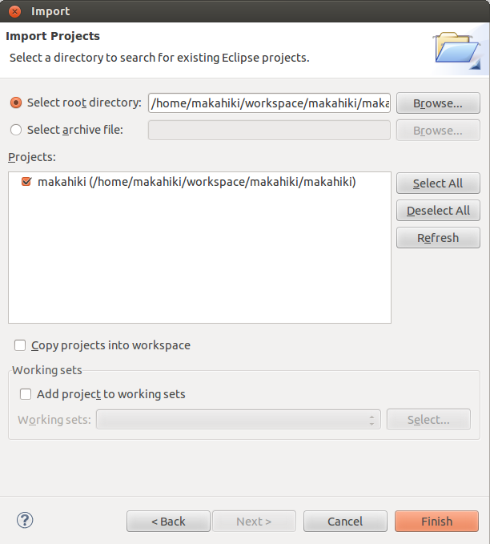
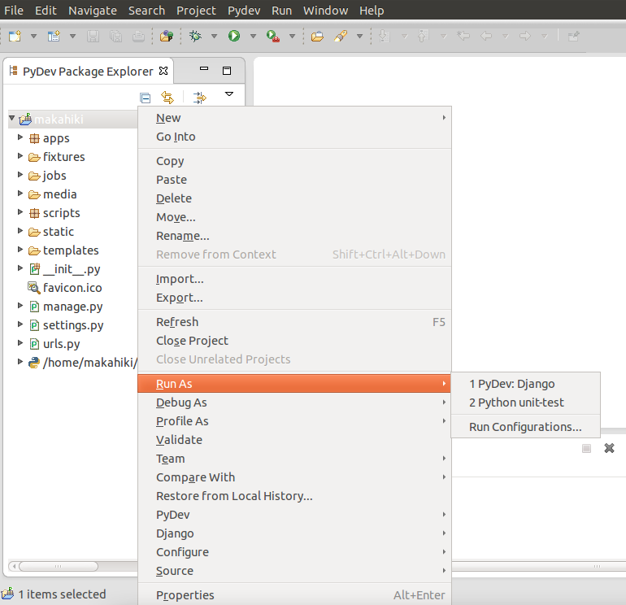
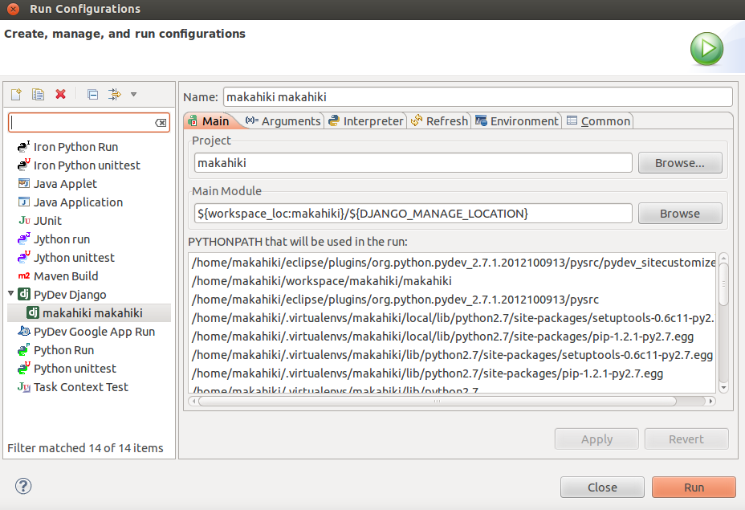

Makahiki Development Environment
================================
This chapter describes how to setup the Makahiki development environment.

Using the Makahiki VirtualBox Virtual Machine
---------------------------------------------
To facilitate the development environment setup, we create an VirtualBox virtual machine which has the necessary dependencies of the Makahiki and the development tools pre-installed. The advantage of developing using the Makahiki VM is the quick set up without the need of installing all the dependency of Makahiki. The shortcoming is of cause the performance penalty of running everything inside a virtual machine.

If you decide not to use the Makahiki virtual machine, you can skip this step. We assume that you have already gone through the local Makahiki installation
successfully, especially, the python virtual environment has been set up.

To use the Makahiki virtual machine, first download it from the following url:

    https://www.dropbox.com/s/4563cxd2rxf1hdm/Makahiki_Ubuntu1204LTS_V1.zip

The download may take a while since the VM image is quite large as about 1.2G. In the mean time, you can download and install the Oracle VirtualBox software (https://www.virtualbox.org/wiki/Downloads) if you have not use VirtualBox before.

.. note:: You may want to install the corresponding version of the VirtualBox Extension Pack after you install the virtualbox software. This provides support for USB 2.0 etc in your VMs.

Once the download completes, unzip the VM into the same directory of the other virtualbox virtual machines. For example, in the Mac OS host, the default virtual machines directory is ~/VirtualBox VMs. If you have not use virtualbox before, you can create the default virtualbox vm directory and unzip the Makahiki vm there.

Once the virtualbox software is installed and the vm files unzipped, locate the Makahiki VM .vbox file, i.e., Makahiki_Ubuntu1204LTS_V1.vbox, and double click, the virtualbox will start and add the makahiki vm in the list of the virtualbox managed vms, as shown in the screenshot here:

.. figure:: figs/development/virtualbox.png
   :width: 600 px
   :align: center

The Makahiki VM is based on Ubuntu 12.04LTS and has the makahiki dependency pre-installed. See the "readme.txt" file in the unzipped directory for details of this VM release and also the login info for the VM.

.. note:: By default, the Makahiki VM is allocated with 2G RAM, which is the recommended configuration for development in Makahiki. If your host machine has limitted memory, you can decrease the RAM by changing the "Base Memory" under the System of the settings of the VM.

Double click on the Makahiki VM in the virtualbox VM manager to start the Makahiki VM, login using the info in the readme.txt file.

Using an IDE
------------
Although you can develop without an IDE, but we recommend using an IDE to program effeciently and effectively. Pydev and Pycharm are two excellent IDEs for
Python/Django development. The following describes the steps involved in
installing and using the Pydev IDE:

1. Install Eclipse and PyDev.

  .. note:: If you use the Makahiki VirtualBox VM, the Eclipse ad PyDev are already installed in the VM image, you can skip this step.

  You want to install a version of Eclipse that includes eGit and WebTools components. The comparison page shows which components are in which versions of Eclipse.  You can choose a version with a superset of these components if you like. After you download the install the Eclipse, you want to install the PyDev following the instructions in “Installing with the Update Site“.

2. Configure the Python Interpreter for PyDev.

  .. note:: If you use the Makahiki VM, you can start the Eclipse by invoking "eclipse" from any path in a shell terminal.

  To configure the interpreter for PyDev in Eclipse, start Eclipse, go to the Eclipse menu::

    Window -> Preferences -> PyDev -> Interpreter - Python

  Choose the interpreter in the virtual environment you have created during the Makahiki Installation. To do that, Click on the "New..." button, and browse and select the python executable under the virtual environment's bin directory, see screenshot below.

On the next screen, click on the "Select All" then "OK".

Fork the Makahiki source
------------------------

You may want to fork the Makahiki source to your own Git repository and manage the
version control in your own repository. To fork the Makahiki source, go to
https://github.com/csdl/makahiki/ and click the "Fork" button. Go to your fork,
you will see your repository has the git url like this:

git@github.com:<your-name>/makahiki.git

This is the Git url you will use for your development in Makahiki.

Now, in the Terminal, cd to ~/workspace (you may want to create this directory
if it does not exist. This is the default directory where Eclipse will place
all the projects.), run the following command to download the forked
Makahiki source::

  % git clone git@github.com/<your-name>/makahiki.git

This will create a directory called "makahiki" containing the source code
for the system.

Workon makahiki
---------------

Next, you need to activate the makahiki virtual environment. To do this, type the following in the Terminal::

  % workon makahiki

This will set up the python environment, as well as the necessary environment
variables in your current shell for developing and running Makahiki. You can examine the environment variables set by the virtual environemnt by looking at the script located at:

    ~/.virtualenvs/makahiki/bin/postactivate

  .. note:: Always activate the virtual environment by running the workon command before doing any Makahiki development or running Makahiki instance.

Initialize or update the Makahiki instance
------------------------------------------

If you had not initialized the Makahiki instance, you need to invoke the initialize_instance script, passing it an argument to specify what kind of initial data to load.  If you had already initialized the instance, you can run the update_instance script to apply any changes from the newly download makahiki source.

To initialize the instance with default dataset, run::

  % scripts/initialize_instance.py -t default

To update the instance from the latest downloaded source, run::

   % ./scripts/update_instance.py

Run Makahiki outsite of Eclipse
-------------------------------
You can start the Makahiki server using::

  % ./manage.py runserver

It will start the makahiki server at http://127.0.0.1:8000.

Import the Makahiki Project into Eclipse
----------------------------------------

Start Eclipse, go to menu::

    File -> Import -> General -> Existing Projects into Workspace

as shown in the following screenshot:

Next, browse and select the Makahiki source you just clone from github in the previous
step. Make sure you select the second makahiki directory which is root directory
of the makahiki Django application. It is also where the Makahiki project definition
file is located. See screenshot below.

Create a Run Confiugration in Eclipse
-------------------------------------

To help you start the Makahiki server conveniently, you can create a "Run Configuration" in Eclipse. To do so, select the makahiki project in the "PyDev Package Explorer", right click to bring up the context menu, select "Run As" and "PyDev Django", see the screenshot below:

It will run the makahiki as a Django project and start the makahiki server at http://127.0.0.1:8000. You can also find the output of the run in the Eclipse run console.

You can verify the running server by going to the above url in a brower. Once verify, go to Eclipse menu::

    Run -> Run Configurations -> PyDev Django -> makahiki makahiki

You will see a run configuration already created for you from the previous "Run as" command, as shown here:

You just need to change the name of the run configuration to the one you like, such as "Local Makahiki".

Now you can stop the server from previous "Run As", and select the newly created run configuration from the menu to start the makahiki server.
