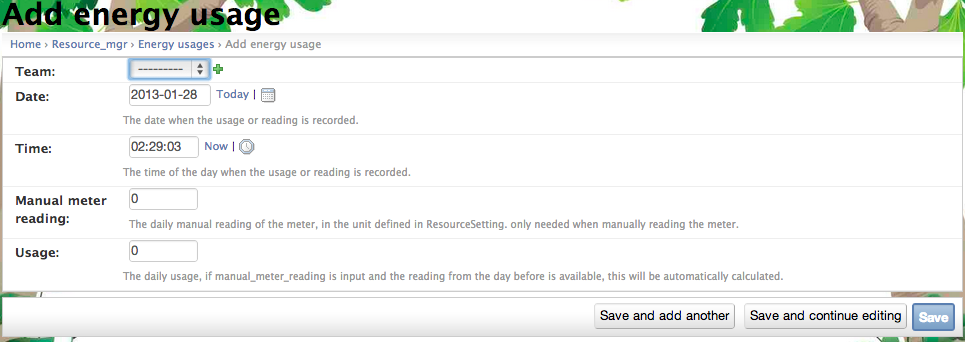

.. _section-execution-manage-resource-game:

Manage the Resource (Energy or Water) game
==========================================

Resource usage data
-------------------

In the case of manual entry of resource usage data, (configured in the resource goal settings page as described above), the resource usage could be input through the "Energy usages" or "Water usage" link. Clicking on the "Add energy usage" link on the list page, a page similar to the following should appear:

The page is used to enter the usage data and the timestamp for the specific team.

In the case of non-manual entry, the energy data is retrieved automatically from the Wattdepot or eGauge data source and stored here. They should not be modified manually.

Click "Save" when finished
--------------------------

Remember to click the Save button at the bottom of the page when finished to save your changes.

