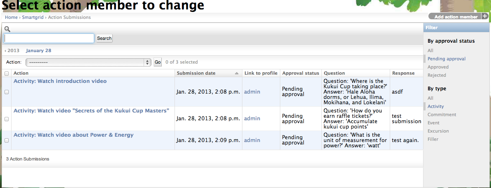
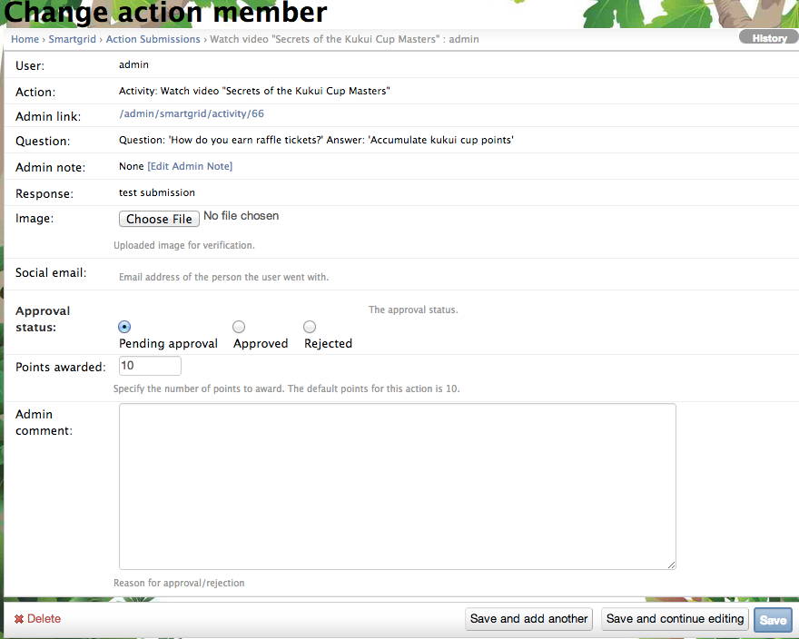
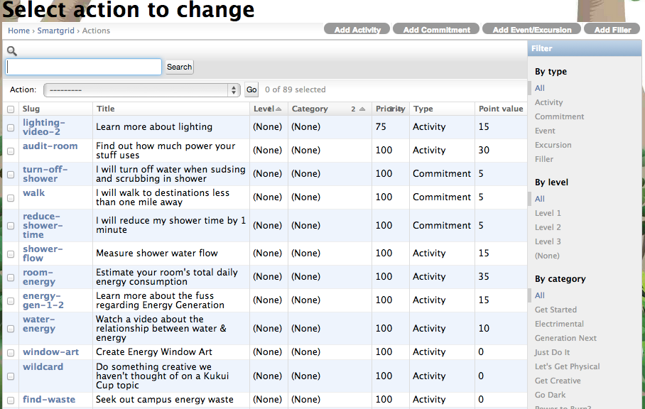
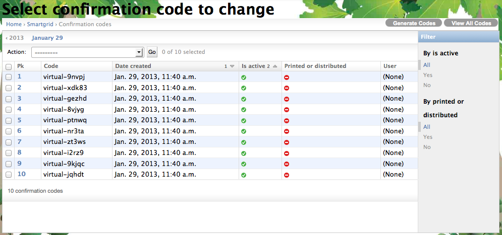
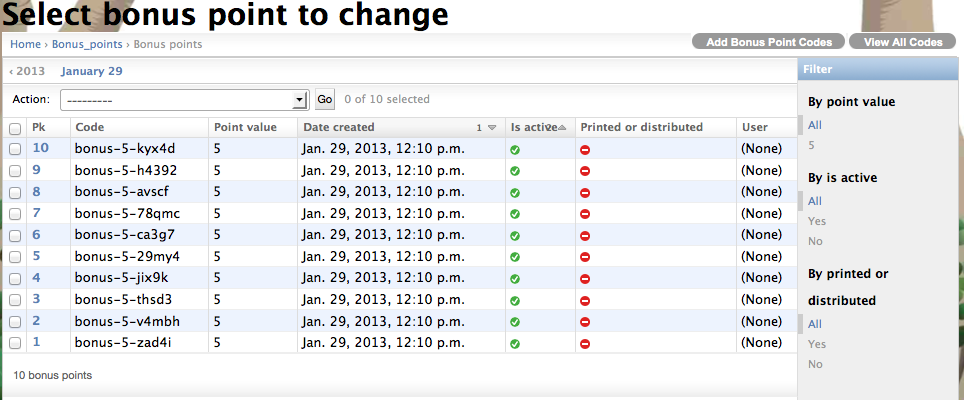

.. _section-execution-manage-smartgrid-game:

Manage the Smart Grid game
==========================

Manage Action submissions
----------------------------

You will need to approve or reject the action submitted from the players. Clicking on the "Action Submissions" link on the smartgrid game admin widget, a page similar to the following should appear:

By default, you will see all submitted actions with the "Pending approval" status. You can click on the link to see the submission details and do the approval there. Or, if the question and answer of the action is simple enough, you can select the action or several actions and use the "Action" dropdown "Approve the selected actions (USE CAUTION)" to approve the selected actions.

You can also go in to the "Change action member" page to look at the full question and answer of the submission, change the "Approval status" and provide the "Admin comment" back to the player.

You will only need to approve the "Activity" type actions, which requires players submitting their answers or responses. For "Commitment" type actions, the system will automatically approve the submission when the player submits after the commitment period ends. For "Event" and "Excursion" type actions, the system will also automatically approve them when the player submits the correct confirmation code.

Manage Attendance codes
-----------------------

For the "Event" and "Excursion" type actions, the attendance codes are used to verify their attendance.  You can create and print the codes to be handed out to the player during an event or excursion. To do so, click on the "Actions" link on the smartgrid game admin widget, you will see a list of actionsa page similar to the following should appear:

First, you will need to find the event or excursion you would like to manage the attendance code. One way is to use the search box on the top of the page to search by name or title of the event. Other way is to use the "filter" box on the right of the page, for example, click on the "Event" link under the "By type" of the filter box, will list all the event type actions.

Then, click on the link of the event/excursion you want to manage the attendance code, you will see:

 .. figure:: figs/configuration/configuration-game-admin-smartgrid-game-event.png
    :width: 600 px
    :align: center

On the top right corner of the page, you will see the "View RSVPs" and "View Confirmation codes" button. You can click on the "View RSVPs" to see how many players has signed up for the event/excursion. This will give you a general idea that at least will you need to generate much more confirmation codes than the RSVPs.

Then, click on the "View Confirmation Codes" button on the top right corner of the page. You will see the "Generate codes" button on the upper right corner of the page. By clicking the button, you will be asked how many codes to be generated. Once you click the "Generate" button, the specified number of the codes will be generated for this event/excursion. You will see a page similar to this:

Clicking the "View all codes" on the upper right corner of the page will display a page of all the codes for you to print out and cut into individual coupons.

Manage Bonus points
-------------------

You can create and print bonus point coupons to be handed out to the player during an event. Clicking on the "Bonus points" link on the smartgrid game admin widget, a page similar to the following should appear:

To add a new bonus code, you can click the "Add Bonus point codes" on the upper right corner of the page. It will ask the number of codes to be generated, as well as the value of the code.

Clicking the "View all codes" on the upper right corner of the page will display a page of all the bonus codes for you to print out and cut into individual coupons.

Click "Save" when finished
--------------------------

Remember to click the Save button at the bottom of the page when finished to save your changes.

