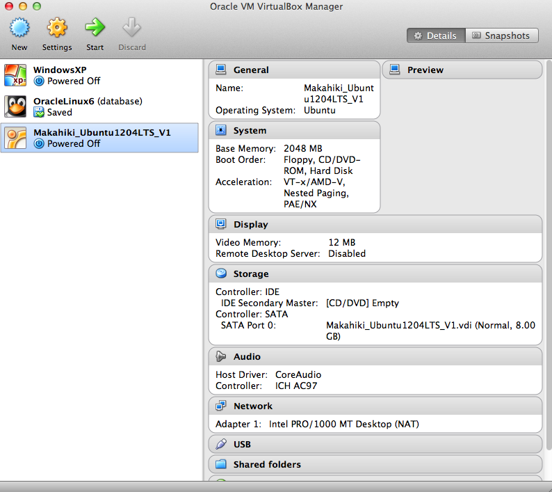

Makahiki installation using VirtualBox
======================================

You can install Linux on any virtual unix environment such as `VirtualBox
<http://virtualbox.org>`_ or `Vmware <http://vmware.com>`_.  The advantage of virtual
unix environments is availability of pre-configured images that make installation very
easy. The disadvantage is the performance penalty of running everything inside a virtual
machine.  If you find the performance penalty too high after installing a virtual
environment, then the solution is to go to a dual boot environment.

The following instructions assume you will use the VirtualBox environment.

Install VirtualBox
------------------
Download and install the Oracle VirtualBox software (https://www.virtualbox.org/wiki/Downloads).

.. note:: Install the corresponding version of the VirtualBox Extension Pack after you install the virtualbox software. This provides support for USB 2.0 etc in your VMs.

Next, you can either use the pre-built Makahiki VirtualBox image or install your own Linux distribution such as Ubuntu on VirtualBox.

Option A: Use the Makahiki VirtualBox Image
-------------------------------------------

To simplify environment setup, we have created a VirtualBox virtual machine image which has
Makahiki and related development tools pre-installed. 

If you don't want to use the pre-built Makahiki virtual image, and prefer to install Linux on virtualbox, see the next section "Install Ubuntu on VirtualBox".

Download the VM Image
*********************
To use the Makahiki virtual machine, first download it from the following url:

    https://www.dropbox.com/s/4563cxd2rxf1hdm/Makahiki_Ubuntu1204LTS_V1.zip

Note that the VM image is quite large (about 1.2 GB).

Once the download completes, unzip the VM into the default directory for VirtualBox
virtual machines. For example, in the Mac OS host, the default virtual machines directory
is ~/VirtualBox VMs. If you have not used VirtualBox before, then you can create the default
virtualbox vm directory and unzip the Makahiki vm into it.

Start the VM
************

Once the VirtualBox software and the VM image are installed, locate the Makahiki VM .vbox
file, i.e., Makahiki_Ubuntu1204LTS_V1.vbox, and double click it.  VirtualBox will start
with the Makahiki VM in the list of the VirtualBox managed VMs, as shown in the screenshot here:

The Makahiki VM is based on Ubuntu 12.04LTS and has 
Makahiki dependencies pre-installed. See the "readme.txt" file in the unzipped directory for details of this VM release and also the login info for the VM.

.. note:: By default, the Makahiki VM is allocated with 2G RAM, which is the recommended configuration for development in Makahiki. If your host machine has limited memory, you can decrease the RAM by changing the "Base Memory" under the System of the settings of the VM.

Double click on the Makahiki VM in the VirtualBox VM manager to start the Makahiki VM, login using the info in the readme.txt file.

Start Makahiki Server
*********************

Continue on from the section "2.1.1.1.10. Download the Makahiki source" in the :ref:`section-installation-makahiki-local` document to start Makahiki this VM.

Option B: Install Ubuntu on VirtualBox
--------------------------------------
The following instructions are for installing your own Ubuntu on VirtualBox instead of using the pre-built Makahiki image.

Download Ubuntu 12
******************

Makahiki supports Ubuntu 12. Download the .iso file `here <http://www.ubuntu.com/download/help/install-desktop-latest>`_.  Be sure to select the right option for x86 (32 bit) or x64 (64 bit) based systems (drop down on the right side of the page).

Create a VM
***********

Start the VirtualBox program, then click "New" to create a new virtual machine:

  #. enter the name of the VM and the type as linux and version as ubuntu
  #. select the memory size, recommend at least 2G
  #. select "Create a virtual hard drive now"
  #. select "VDI" as the hard drive file type
  #. select "Dynamically allocated" as the storage option
  #. click finish to create the VM

Now the newly create VM should show up in the VM list.

Setup the CD/DVD drive on the VM
********************************

  * Click the storage settings of the VM, then 
  * click the CD/DVD drive option, then 
  * click the CD icon next to the "IDE Secondary" drop down, then
  * select "choose a virtual CD/DVD file", and locate the downloaded ubuntu installation iso file.

Install Ubuntu
**************

Power up the VM, the installer should run automatically from Ubuntu installation iso setted up in the CD/DVD.

Follow the `Ubuntu installation guide <http://www.ubuntu.com/download/help/install-desktop-latest>`_ to install the Ubuntu.

Install Guest Addition
**********************

After the installation and reboot, you can install the VirtualBox Guest Addition for the
VM to get better integration between your VM and the host environment, such as
"auto-resize guest display" and "share folders" functionality. To install the Guest
Addition, make sure you VM is running, click on the VirtualBox Menu, "Devices" -> "Install
Guest Addition...", It will start the installing process in a new window.

Install Makahiki (via local Unix installation)
**********************************************

Once you have installed the Linux VM, you can now finish the installation of Makahiki by following the document :ref:`section-installation-makahiki-local`.

