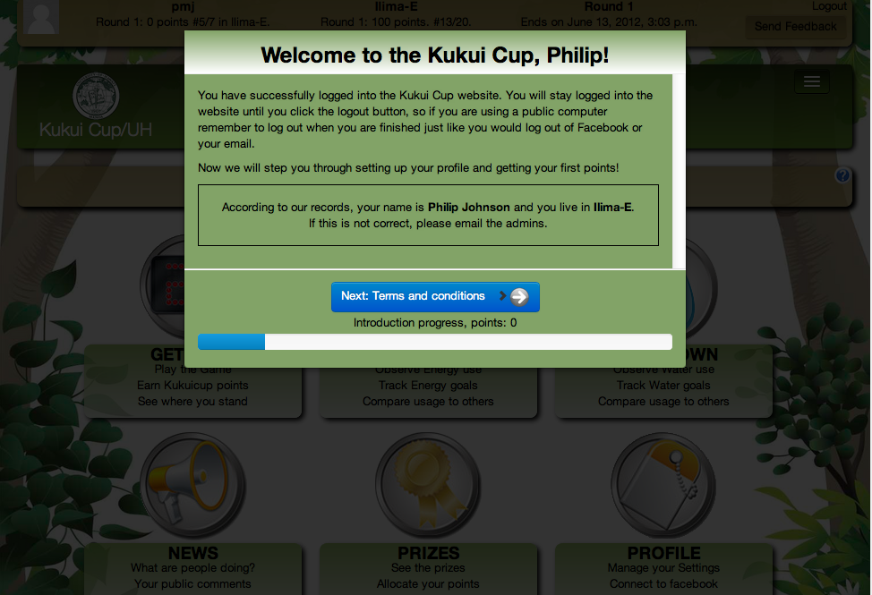
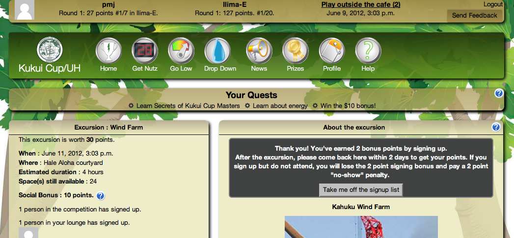
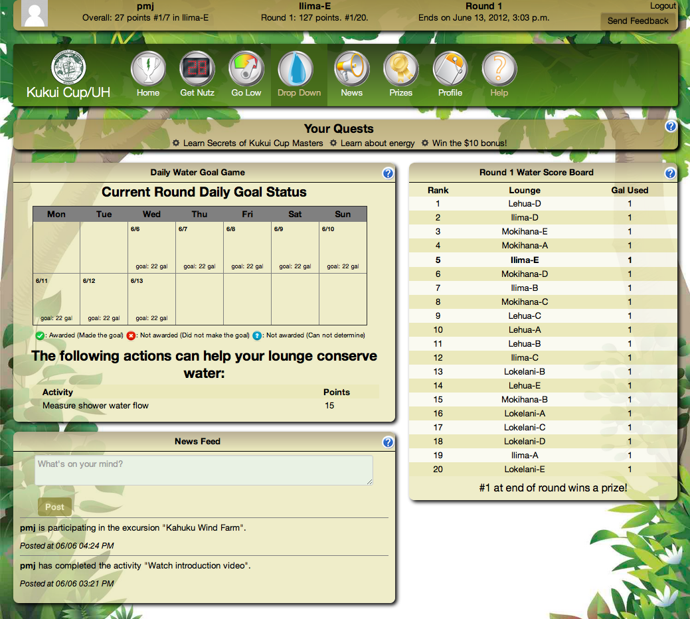

Guided Tour
===========

Perhaps the best way to introduce Makahiki is through a simple tour of its interface.  The following tour was developed using a test instance of the system in Summer, 2012.  Not all features of the system will be covered in this tour, and 
some features may be slightly different in the version of the system you are using. 

This guided tour illustrates the laptop user interface.  Makahiki is designed in a "responsive" fashion, so the user interface will look slightly different from this on iPads, smart phones, and large screen displays. 

Landing
-------
.. figure:: figs/guided-tour/guided-tour-landing.png
   :width: 600 px
   :align: center

The landing page is the first page encountered by new users.  So far, challenges built using Makahiki have a "closed" registration model; that is, the users of the system are known in advance and set up during the configuration process.  Thus, the landing page has two buttons: one for users who live in a particular place and thus should have access to the system, and one for those who are just visiting and would like to learn more about the system.

Most of the content on this page is configurable, including the University logo, the slogan, the text fields and button contents, and the sponsors. 

About
-----

.. figure:: figs/guided-tour/guided-tour-about.png
   :width: 600 px
   :align: center

Users who click on the bottom button on the landing page are taken to this About page, which provides more information about the Challenge.  This content is configurable.

Authentication
--------------

.. figure:: figs/guided-tour/guided-tour-authentication.png
   :width: 600 px
   :align: center

Users who click on the top button on the landing page are taken to an authentication page.   Makahiki supports CAS, LDAP, and internal (Django) authentication mechanisms.   The screen shot above shows the University of Hawaii CAS authentication screen. 

Site administrators can configure which authentication scheme(s) are used for any particular challenge. 

First login sequence
--------------------

If a user provides acceptable credentials during the authentication process, then the first time they access the system they enter the "first login" process, which is a series of modal dialogs intended to help orient them to the system. 

The above dialog provides initial information about logging in and requests verification that the system's internal records about the user are correct.

.. figure:: figs/guided-tour/guided-tour-first-login-terms.png
   :width: 600 px
   :align: center

The above dialog ensures that the user has consented to the terms and conditions of the system. (The terms and conditions are configurable.) 

.. figure:: figs/guided-tour/guided-tour-first-login-referral-bonus.png
   :width: 600 px
   :align: center

The next dialog illustrates one of Makahiki's game mechanics: the referral bonus.  If a player gets another player to sign up, both players earn additional points.   

The use of the referral bonus game mechanic, and the number of points awarded, is configurable. 

.. figure:: figs/guided-tour/guided-tour-first-login-profile.png
   :width: 600 px
   :align: center

The dialog above enables users to customize aspects of their profile. 

If Facebook integration is enabled, then users can choose to use their Facebook profile picture.  (Facebook integration is not enabled in this configuration.)

.. figure:: figs/guided-tour/guided-tour-first-login-video.png
   :width: 600 px
   :align: center

When first time players get to the above dialog box, they are asked to watch a short, 3 minute video that introduces them to the Kukui Cup.  They are notified that they will be quizzed on this material in the next screen.

.. figure:: figs/guided-tour/guided-tour-first-login-video-verification.png
   :width: 600 px
   :align: center

Players answer the question in order to proceed and obtain points for doing so. 

.. figure:: figs/guided-tour/guided-tour-first-login-final.png
   :width: 600 px
   :align: center

The above screen is the final one in the first login sequence, which provides some final comments about what happens next and a plug for the Quest mechanism as an additional tool to supporting learning about the system.

Home
----

After finishing the first login sequence, the players are taken to the following Home page.   The system sets a cookie when the player authenticates, and notes that the first login sequence has been completed.  Thus, after the first visit, the player will normally go directly to this page when retrieving the challenge URL. 

.. figure:: figs/guided-tour/guided-tour-home.png
   :width: 600 px
   :align: center

The user interface components are discussed in the three minute video, so the player should have some familiarity with them when they reach this page for the first time.   From top to bottom:

  * The "Info Bar" is a horizontal UI component at the top of every page.  It provides status information about the challenge as well as a logout link.  (The player will not normally need to logout unless they are accessing the site from a public computer.)

  * The "Nav Bar" is a horizontal UI component below the Info Bar, which provides icons that link to all of the top-level pages in the system.  The set of pages in the system is configurable.

  * The "Quest Bar" is a horizontal UI component below the Nav Bar.   It provides "Quests" (explained in more detail below).

Those three elements appear on every page.   On the home page, below these three components, are enlarged images of the icons in the Nav Bar along with short descriptions of their content.  

Quests
------

Makahiki provides a configurable "Quest Engine", that enables the definition of quests and the dependencies among them.  That enables site developers to create a kind of structured, "just-in-time" documentation for the system. Users learn about the capabilities of the site by performing discrete sequences of actions. Quests have a completion predicate, so if a plauyer has already shown mastery of a certain concept, the Quest will not appear. 

The Quest Bar shows the next three quests available for the player. Clicking on the link expands the window to reveal the quest. Once expanded, the window stays that way even as players navigate to other pages so that the Quest description is always accessable while the Player carries out the associated actions.   

Here is the expanded window corresponding to the "Learn Secrets of Kukui Cup Masters" quest:

.. figure:: figs/guided-tour/guided-tour-quests.png
   :width: 600 px
   :align: center

Get Nutz
--------

The "Get Nutz" page provides the user interface to the primary "literacy" game, also known as the "Smart Grid Game".  Players gain points by clicking on cells in the Smart Grid widget, which takes them to activities, commitments, events, and excursions.  

Here is an example of the Get Nutz page (the name of this page and any other top-level page can be configured by site administrators):

.. figure:: figs/guided-tour/guided-tour-get-nutz.png
   :width: 600 px
   :align: center

The page also provides widgets about upcoming events and a scoreboard showing point leaders. 

Clicking on the 30 point purple link in the middle of the smart grid game takes the player to a page explaining that excursion.  Here is an example of that page:

.. figure:: figs/guided-tour/guided-tour-excursion.png
   :width: 600 px
   :align: center

This page also provides social details (how many other students have signed up) and enables students to request a reminder by email or text message.

It also implements the "signup bonus" game mechanic. After clicking on the "I want to sign up" link, the page displays the following additional information to the player:

Go Low
------

The "Go Low" page provides the user interface to two "energy" games, as shown below:

.. figure:: figs/guided-tour/guided-tour-go-low.png
   :width: 600 px
   :align: center

On the left side, the "Daily Energy Goal Game" incentivizes players to reduce their energy usage by awarding them points if they can reduce their team's energy by a certain percentage below a baseline value.  The stoplight visualization tells them whether or not they are currently on track to make the goal.

On the right side, the "Current Power" visualization helps players to see what their current power consumption is in near real-time (typically every 10-15 seconds.) 

The page also enables team members to communicate via a shared chat window, and provides a scoreboard widget showing leaders in energy conservation.

This Go Low page is configured with an "automated" Daily Energy Goal Game, in which the energy data is gathered automatically by meters.  Administrators are required to set up this communication, typically using the `WattDepot`_ system.

.. _`WattDepot`: http://wattdepot.googlecode.com/

The next page shows an alternative approach available in Makahiki when the resource in question cannot be gathered automatically.

Drop Down
---------

The "Drop Down" page provides a user interface to a "water" game, as shown below:

The difference between the Daily Energy Goal Game in the previous page and the Daily Water Goal Game shown here is that the Daily Water Goal Game is played with only access to daily (manual) readings of the water meter.  That means that the system cannot provide a stoplight visualization, because there is no way to monitor progress toward the goal. Instead, this visualization is simply a calendar that shows whether the team made their goal for the day or not. 

Administrators are required to enter the data by hand. 

Note that Makahiki can be configured to support manual or automated data collection for any resource of interest to the challenge (water, energy, waste, food, etc.) 

News
----

The "News" page provides information about the state of the challenge and the team of which this player is a member:

.. figure:: figs/guided-tour/guided-tour-news.png
   :width: 600 px
   :align: center

Widgets such as "Lounge Members", "Most Popular Excursion", "My Public Commitments", etc. all provide a sense for the state of the competition and encourage players to participate by learning about what others members are doing. 

Prizes
------

The "Prizes" page provides access to two games:  the "Top Scorer" game and the "Raffle" game:

.. figure:: figs/guided-tour/guided-tour-prizes.png
   :width: 600 px
   :align: center

The Top Scorer game, illustrated by the widget on the left, shows the prizes that can be won by top scorers in the competition. 

The Raffle Game provides an alternative route to winning.  Here, players earn in-game raffle tickets based upon their point score that can be allocated to any of a collection of raffle prizes.  The odds of winning are based upon the percentage of their tickets allocated to the prize, which is picked at random at the end of a round by administrators. 

The Raffle Game provides an incentive for players to do activities and earn points even if they do not stand a chance of winning one of the Top Scorer prizes. 

Profile
-------

The "Profile" page provides access to profile information for this player:

.. figure:: figs/guided-tour/guided-tour-profile.png
   :width: 600 px
   :align: center

The user can set their display name, their picture, and how they wish to be contacted for reminders.   It also shows information about their badges and a complete record of how they earned all of the points in the game.  

The profile page also allows them to change the theme associated with the site.   A variety of themes are available. In this configuration, the default theme is "Forest", but the user can go to the Profile page to set a different them for their own use.  For example, here is the "Wave" theme:

.. figure:: figs/guided-tour/guided-tour-profile-wave.png
   :width: 600 px
   :align: center

And here is the "Space" theme:

.. figure:: figs/guided-tour/guided-tour-profile-space.png
   :width: 600 px
   :align: center

Help
----

The final page available to players is the Help page, which simply provides access to explanatory material about the system:

.. figure:: figs/guided-tour/guided-tour-help.png
   :width: 600 px
   :align: center

Status (Admin only)
-------------------

Administrators have access to special pages.  One of these is called the "Status" page, which displays a large number of different widgets with various kinds of information about the state of an ongoing challenge. Here is a screenshot of part of the Status page (with the "Bumblebee" theme enabled):

.. figure:: figs/guided-tour/guided-tour-status.png
   :width: 600 px
   :align: center

The Status page is designed to help administrators to monitor the progress of their challenge, detect problems with the system and/or state of play, and intercede to correct them in a timely manner. 

Settings (Admin only)
---------------------

The final page to be shown in this guided tour is the settings page, which is also restricted to Administrators:

.. figure:: figs/guided-tour/guided-tour-settings.png
   :width: 600 px
   :align: center

Administrators use the Settings page to configure the site, design the challenge, manage a
running challenge, generate analytics after the challenge is over, and support new
development.  These capabilities are documented further in :ref:`section-site-configuration`.

