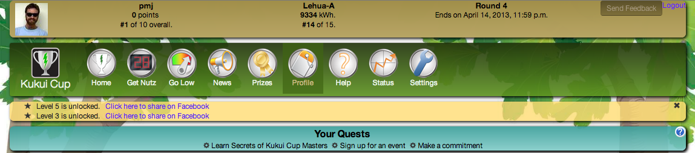

.. Makahiki documentation master file, created by
   sphinx-quickstart on Mon Feb  6 10:22:39 2012.
   You can adapt this file completely to your liking, but it should at least
   contain the root `toctree` directive.

Introduction
============

   *Partial screenshot of the Kukui Cup challenge, built using Makahiki.*

Goals
-----

Makahiki is an open source "serious game engine for sustainability".  It
provides a framework for creating `serious games`_ for the purpose of
education and behavioral change regarding energy, water, food, and
waste generation and use.  

The initial version of Makahiki (Version 1) was developed in support of
first `Kukui Cup`_ energy challenge held at the University of Hawaii in
Fall, 2011.  Some of the goals of the Kukui Cup challenge are to support:

  * A synergistic mixture of real-world and virtual world activities. 
  * Real-time feedback on energy consumption by residence hall teams.
  * Incentives in the form of prizes and raffle games. 
  * Social networks, both physical (residence hall teams) and virtual (Facebook).
  * Activities to raise player consciousness and literacy regarding energy issues.

Makahiki 2 builds upon the prior version with the following new features:

  * The ability to tailor system functionality to support the requirements
    of different organizations.
  * Support for PaaS (`Platform as a Service`_) facilities such as `Heroku`_.  This enables
    organizations to create and deploy challenges  without obtaining
    physical hardware and its requisite IT support.
  * The ability to extend the framework with new modules to support 
    sustainable resource challenges such as water, food, and waste in
    addition to energy.
  * The use of HTML5/CSS3 "responsive" design techniques for support of
    laptop, tablet, and smart phone interfaces. 
  * Real-time game analytics to help assess the impact of game mechanics
    during challenges.
  * A-B testing to support research evaluation of components by deploying
    alternative versions to subsets of the population. (Under development)

Related Projects
----------------

Perhaps the closest projects to Makahiki are the `Campus Conservation
Nationals`_ (CCN) and the `Oberlin Campus Resource Monitoring System`_.
The CCN provides a limited mechanism for competition between universities
than Makahiki, but has achieved a broad reach of dozens of universities and
thousands of students nationwide.  

Neither the CCN or Oberlin's system includes Makahiki's support for game
mechanics, education, or synergy between real and virtual world
environments. In addition, neither of these systems are open source. 

.. _serious games: http://en.wikipedia.org/wiki/Serious_game
.. _Kukui Cup: http://kukuicup.org
.. _Heroku: http://heroku.com
.. _Campus Conservation Nationals: http://www.competetoreduce.org/
.. _Oberlin Campus Resource Monitoring System: http://www.oberlin.edu/dormenergy
.. _Platform as a Service: http://en.wikipedia.org/wiki/Platform_as_a_service

Research Publications
---------------------

We maintain a online `list of research publications on Makahiki`_.

.. _list of research publications on Makahiki: http://www.citeulike.org/group/3370/tag/makahiki

Contact Us
----------

For more information about this project, please contact the director:

  | Professor Philip Johnson
  | Information and Computer Sciences
  | University of Hawaii
  | Honolulu, HI 96822
  | johnson@hawaii.edu
  | 808-956-3489

Of course, the vast majority of work has been done by talented graduate
students at the University of Hawaii, including: George Lee, Yongwen Xu,
and Robert Brewer. 

